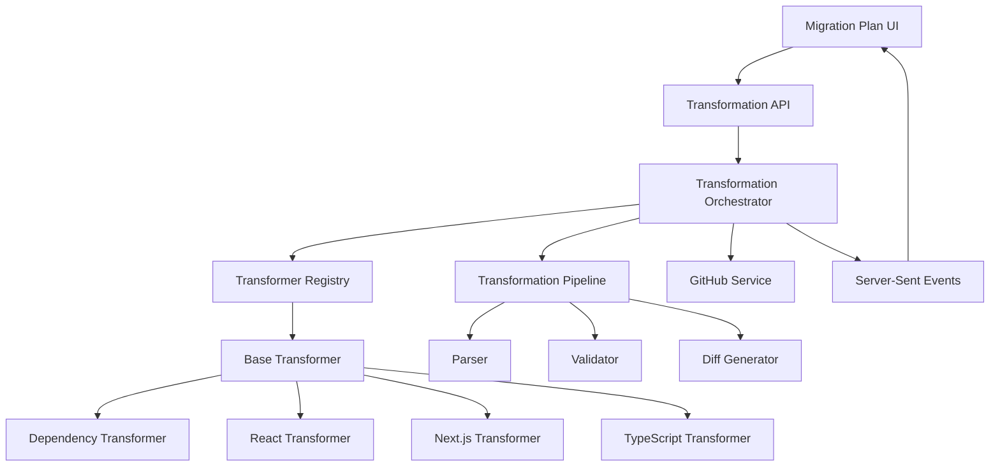
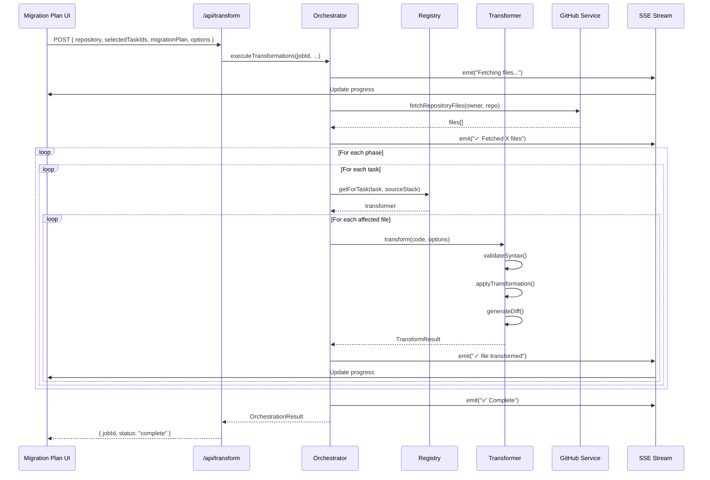
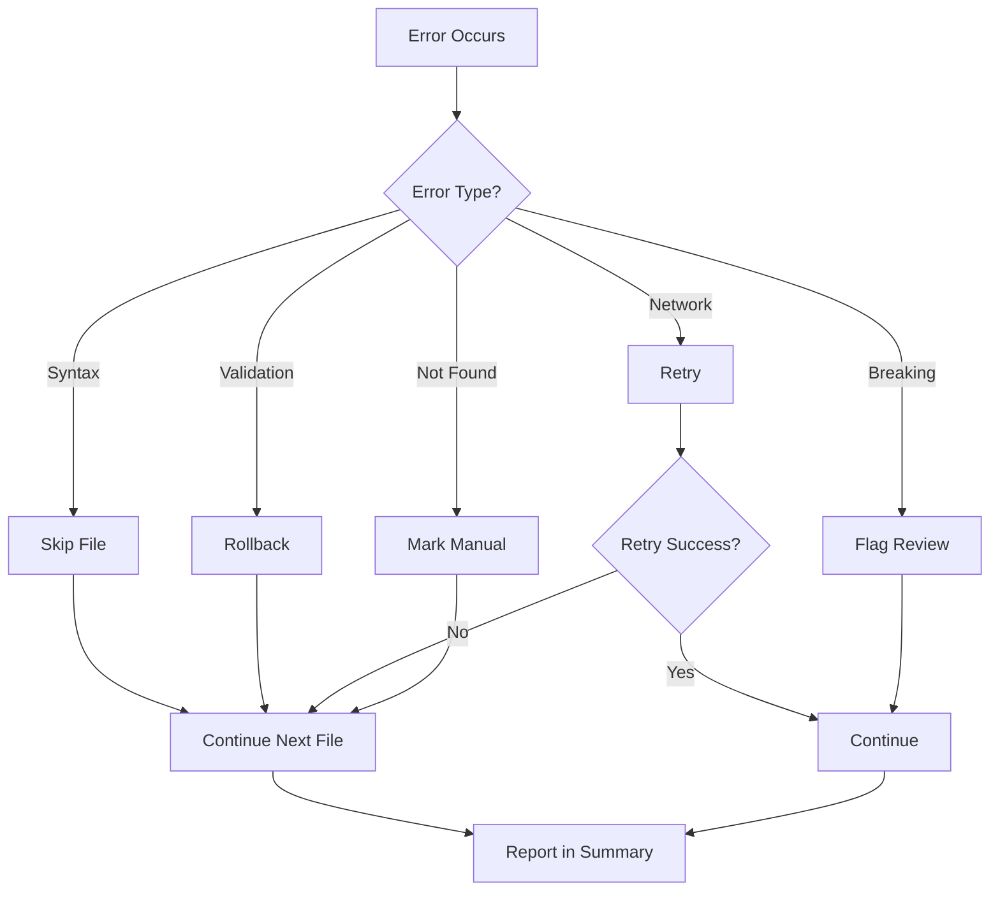

# Design Document

## Overview

The Base Transformer Architecture provides a robust, extensible framework for safely transforming source code across multiple languages and frameworks. The system integrates seamlessly with ReviveHub's migration planning workflow, enabling users to select specific tasks from a migration plan and execute automated code transformations with comprehensive validation, real-time progress tracking, and detailed diff generation.

### Key Design Principles

1. **Safety First**: All transformations are validated before and after execution with automatic rollback on failure
2. **Extensibility**: Plugin-based architecture allows new transformers without modifying core code
3. **Transparency**: Real-time progress updates and comprehensive diff generation for user review
4. **Intelligence**: Pattern-based routing automatically selects appropriate transformers
5. **Modularity**: Clear separation between transformation logic, validation, and orchestration

## Architecture

### High-Level System Architecture



### Component Hierarchy

```
lib/
├── transformers/
│   ├── base-transformer.ts          # Abstract base class
│   ├── transformer-registry.ts      # Registry and routing
│   ├── transformation-pipeline.ts   # Orchestration
│   ├── diff-generator.ts            # Diff creation
│   ├── validator.ts                 # Validation system
│   ├── orchestrator.ts              # Multi-transformation coordination
│   ├── react/
│   │   ├── class-to-hooks-transformer.ts
│   │   ├── ast-helpers.ts
│   │   ├── hook-mapper.ts
│   │   └── state-converter.ts
│   ├── nextjs/
│   │   ├── pages-to-app-transformer.ts
│   │   ├── route-mapper.ts
│   │   ├── data-fetching-converter.ts
│   │   └── layout-generator.ts
│   ├── typescript/
│   │   └── proptypes-to-ts-transformer.ts
│   ├── dependencies/
│   │   └── dependency-updater.ts
│   └── documentation/
│       └── documentation-transformer.ts
├── github/
│   └── content-service.ts           # Fetch repository files
└── sse/
    └── progress-emitter.ts          # Real-time updates

types/
└── transformer.ts                   # TypeScript interfaces

app/
└── api/
    └── transform/
        ├── route.ts                 # Main API endpoint
        └── stream/
            └── [jobId]/
                └── route.ts         # SSE endpoint
```


## Components and Interfaces

### 1. Core Type Definitions

**File**: `types/transformer.ts`

```typescript
// Migration Plan Types (from existing system)
export interface MigrationPlan {
  id: string
  sourceStack: SourceStack
  targetStack: TargetStack
  phases: Phase[]
  summary: Summary
  dependencyGraph: DependencyNode[]
  customization: Customization
  createdAt: string
  aiInsights: AIInsights
  aiMetadata: AIMetadata
}

export interface Phase {
  id: string
  name: string
  description: string
  order: number
  tasks: Task[]
  totalEstimatedMinutes: number
  totalAutomatedMinutes: number
  riskLevel: 'low' | 'medium' | 'high'
  canRunInParallel: boolean
}

export interface Task {
  id: string
  name: string
  description: string
  type: 'automated' | 'manual' | 'review'
  estimatedMinutes: number
  automatedMinutes: number
  riskLevel: 'low' | 'medium' | 'high'
  affectedFiles: string[]
  dependencies: string[]
  breakingChanges: string[]
  pattern: Pattern
}

export interface Pattern {
  id: string
  name: string
  category: 'dependency' | 'structural' | 'code-quality' | 'documentation'
  severity: 'low' | 'medium' | 'high'
  occurrences: number
  affectedFiles: string[]
  description: string
  automated: boolean
}

// Transformation Types
export interface TransformOptions {
  aggressive?: boolean
  skipTests?: boolean
  preserveFormatting?: boolean
  dryRun?: boolean
}

export interface TransformResult {
  success: boolean
  code?: string
  diff?: Diff
  metadata: TransformMetadata
  errors: TransformError[]
  warnings: string[]
}

export interface TransformMetadata {
  transformationType: string
  filesModified: string[]
  linesAdded: number
  linesRemoved: number
  confidenceScore: number
  riskScore: number
  requiresManualReview: boolean
  estimatedTimeSaved: string
  transformationsApplied: string[]
}

export interface Diff {
  original: string
  transformed: string
  unified: string
  visual: DiffLine[]
  characterLevel: CharacterDiff[]
}

export interface DiffLine {
  type: 'added' | 'removed' | 'unchanged' | 'modified'
  lineNumber: number
  content: string
  oldLineNumber?: number
  newLineNumber?: number
}

export interface ValidationResult {
  isValid: boolean
  errors: ValidationError[]
  warnings: string[]
  syntaxValid: boolean
  semanticValid: boolean
  buildValid?: boolean
  testsValid?: boolean
}

export interface TransformError {
  message: string
  code: string
  location?: { line: number; column: number }
  suggestions: string[]
  severity: 'error' | 'warning'
}
```


### 2. Base Transformer Class

**File**: `lib/transformers/base-transformer.ts`

The abstract base class that all transformers extend.

```typescript
export abstract class BaseTransformer {
  protected name: string
  protected supportedPatternCategories: string[]
  protected supportedFrameworks: string[]
  
  constructor(name: string, categories: string[], frameworks: string[]) {
    this.name = name
    this.supportedPatternCategories = categories
    this.supportedFrameworks = frameworks
  }
  
  // Abstract method - must be implemented by subclasses
  abstract transform(
    code: string, 
    options: TransformOptions
  ): Promise<TransformResult>
  
  // Validate syntax before transformation
  async validateSyntax(code: string): Promise<ValidationResult> {
    // Parse code to check syntax validity
    // Return validation result with errors/warnings
  }
  
  // Calculate risk score (0-100)
  calculateRiskScore(transformation: TransformResult): number {
    // Analyze complexity, lines changed, breaking changes
    // Return risk score
  }
  
  // Generate diff between original and transformed
  generateDiff(original: string, transformed: string): Diff {
    // Create character-level and line-level diffs
    // Return comprehensive diff object
  }
  
  // Create backup of original code
  createBackup(code: string): string {
    // Generate unique backup ID
    // Store backup with timestamp
    // Return backup ID
  }
  
  // Restore from backup
  async restoreBackup(backupId: string): Promise<string> {
    // Retrieve backup by ID
    // Return original code
  }
  
  // Check if transformer can handle this task
  canHandle(task: Task, sourceStack: SourceStack): boolean {
    // Check pattern category match
    // Check framework compatibility
    // Return boolean
  }
}
```

**Key Design Decisions**:
- Abstract class forces implementation of `transform()` method
- Built-in validation, diff generation, and backup capabilities
- Risk scoring based on multiple factors (complexity, changes, breaking changes)
- Framework and pattern category matching for intelligent routing


### 3. Transformer Registry

**File**: `lib/transformers/transformer-registry.ts`

Central registry for managing and routing transformers.

```typescript
export class TransformerRegistry {
  private transformers: Map<string, BaseTransformer> = new Map()
  private categoryMap: Map<string, string[]> = new Map()
  
  // Register a transformer
  register(transformer: BaseTransformer): void {
    // Add to transformers map
    // Update category mappings
  }
  
  // Get transformer by pattern category
  getByCategory(
    category: string, 
    sourceStack: SourceStack
  ): BaseTransformer | null {
    // Lookup transformers for category
    // Filter by framework compatibility
    // Return most specific match
  }
  
  // Get transformer for specific task
  getForTask(task: Task, sourceStack: SourceStack): BaseTransformer | null {
    // Extract pattern category from task
    // Check framework compatibility
    // Return matching transformer
  }
  
  // Get all registered transformers
  getAll(): BaseTransformer[] {
    return Array.from(this.transformers.values())
  }
  
  // Check if transformer exists for category
  hasTransformer(category: string): boolean {
    return this.categoryMap.has(category)
  }
}

// Singleton instance
export const transformerRegistry = new TransformerRegistry()

// Register built-in transformers
transformerRegistry.register(new DependencyUpdaterTransformer())
transformerRegistry.register(new ClassToHooksTransformer())
transformerRegistry.register(new PagesToAppTransformer())
transformerRegistry.register(new PropTypesToTSTransformer())
transformerRegistry.register(new DocumentationTransformer())
```

**Key Design Decisions**:
- Singleton pattern for global access
- Category-based routing with framework filtering
- Lazy loading support for transformer plugins
- Automatic registration of built-in transformers


### 4. Transformation Pipeline

**File**: `lib/transformers/transformation-pipeline.ts`

Orchestrates the transformation process through defined stages.

```typescript
export class TransformationPipeline {
  private stages: PipelineStage[] = [
    new ParseStage(),
    new ValidateStage(),
    new TransformStage(),
    new VerifyStage(),
    new FormatStage()
  ]
  
  async execute(
    code: string,
    transformer: BaseTransformer,
    options: TransformOptions
  ): Promise<TransformResult> {
    let currentCode = code
    const metadata: TransformMetadata = {
      transformationType: transformer.name,
      filesModified: [],
      linesAdded: 0,
      linesRemoved: 0,
      confidenceScore: 0,
      riskScore: 0,
      requiresManualReview: false,
      estimatedTimeSaved: '0 minutes',
      transformationsApplied: []
    }
    
    // Create backup
    const backupId = transformer.createBackup(code)
    
    try {
      // Execute each stage
      for (const stage of this.stages) {
        const result = await stage.execute(currentCode, transformer, options)
        
        if (!result.success) {
          // Rollback on failure
          await transformer.restoreBackup(backupId)
          throw new Error(`Stage ${stage.name} failed: ${result.error}`)
        }
        
        currentCode = result.output
      }
      
      // Generate diff
      const diff = transformer.generateDiff(code, currentCode)
      
      // Calculate metrics
      metadata.linesAdded = diff.visual.filter(l => l.type === 'added').length
      metadata.linesRemoved = diff.visual.filter(l => l.type === 'removed').length
      
      // Calculate risk and confidence
      const transformResult: TransformResult = {
        success: true,
        code: currentCode,
        diff,
        metadata,
        errors: [],
        warnings: []
      }
      
      metadata.riskScore = transformer.calculateRiskScore(transformResult)
      metadata.confidenceScore = this.calculateConfidence(transformResult)
      metadata.requiresManualReview = metadata.riskScore > 70
      
      return transformResult
      
    } catch (error) {
      // Restore backup on error
      await transformer.restoreBackup(backupId)
      
      return {
        success: false,
        metadata,
        errors: [{
          message: error.message,
          code: code,
          suggestions: ['Review error logs', 'Check code syntax'],
          severity: 'error'
        }],
        warnings: []
      }
    }
  }
  
  private calculateConfidence(result: TransformResult): number {
    // Factor in validation results, complexity, risk score
    // Return confidence score 0-100
  }
}

interface PipelineStage {
  name: string
  execute(
    code: string, 
    transformer: BaseTransformer, 
    options: TransformOptions
  ): Promise<StageResult>
}

interface StageResult {
  success: boolean
  output: string
  error?: string
}
```

**Key Design Decisions**:
- Sequential stage execution with early exit on failure
- Automatic backup creation and rollback on error
- Confidence scoring based on multiple validation factors
- Extensible stage system for custom validation steps


### 5. Transformation Orchestrator

**File**: `lib/transformers/orchestrator.ts`

Coordinates execution of multiple transformations from a migration plan.

```typescript
export class TransformationOrchestrator {
  private pipeline: TransformationPipeline
  private registry: TransformerRegistry
  private githubService: GitHubContentService
  private progressEmitter: ProgressEmitter
  
  constructor() {
    this.pipeline = new TransformationPipeline()
    this.registry = transformerRegistry
    this.githubService = new GitHubContentService()
    this.progressEmitter = new ProgressEmitter()
  }
  
  async executeTransformations(
    jobId: string,
    repository: { owner: string; name: string },
    migrationPlan: MigrationPlan,
    selectedTaskIds: Set<string>,
    options: TransformOptions
  ): Promise<OrchestrationResult> {
    
    this.progressEmitter.emit(jobId, 'Fetching repository files...')
    
    // 1. Fetch repository files from GitHub
    const files = await this.githubService.fetchRepositoryFiles(
      repository.owner,
      repository.name
    )
    
    this.progressEmitter.emit(jobId, `✓ Fetched ${files.length} files`)
    
    // 2. Extract selected tasks from migration plan
    const selectedTasks = this.extractSelectedTasks(
      migrationPlan,
      selectedTaskIds
    )
    
    // 3. Group tasks by phase and sort by order
    const tasksByPhase = this.groupTasksByPhase(selectedTasks, migrationPlan)
    
    const results: TaskResult[] = []
    const transformedFiles: Map<string, string> = new Map()
    
    // 4. Execute phases sequentially
    for (const [phase, tasks] of tasksByPhase) {
      this.progressEmitter.emit(
        jobId,
        `Starting Phase ${phase.order}: ${phase.name}`
      )
      
      // 5. Execute tasks within phase
      for (const task of tasks) {
        this.progressEmitter.emit(jobId, `⚙️ ${task.name}...`)
        
        try {
          // Get appropriate transformer
          const transformer = this.registry.getForTask(
            task,
            migrationPlan.sourceStack
          )
          
          if (!transformer) {
            results.push({
              taskId: task.id,
              success: false,
              error: 'No transformer available for this task',
              skipped: true
            })
            continue
          }
          
          // Transform affected files
          for (const filePath of task.affectedFiles) {
            const file = files.find(f => f.path === filePath)
            if (!file) continue
            
            const result = await this.pipeline.execute(
              file.content,
              transformer,
              options
            )
            
            if (result.success && result.code) {
              transformedFiles.set(filePath, result.code)
              this.progressEmitter.emit(jobId, `✓ ${filePath} transformed`)
            }
            
            results.push({
              taskId: task.id,
              filePath,
              success: result.success,
              result,
              error: result.errors[0]?.message
            })
          }
          
        } catch (error) {
          results.push({
            taskId: task.id,
            success: false,
            error: error.message
          })
        }
      }
      
      this.progressEmitter.emit(jobId, `✓ Phase ${phase.order} complete`)
    }
    
    // 6. Calculate summary metrics
    const summary = this.calculateSummary(results, transformedFiles)
    
    this.progressEmitter.emit(jobId, '✅ Transformation complete!')
    this.progressEmitter.complete(jobId, summary)
    
    return {
      jobId,
      success: results.every(r => r.success || r.skipped),
      transformedFiles,
      results,
      summary
    }
  }
  
  private extractSelectedTasks(
    plan: MigrationPlan,
    selectedIds: Set<string>
  ): Task[] {
    const tasks: Task[] = []
    for (const phase of plan.phases) {
      for (const task of phase.tasks) {
        if (selectedIds.has(task.id)) {
          tasks.push(task)
        }
      }
    }
    return tasks
  }
  
  private groupTasksByPhase(
    tasks: Task[],
    plan: MigrationPlan
  ): Map<Phase, Task[]> {
    // Group tasks by their parent phase
    // Sort phases by order
    // Return ordered map
  }
  
  private calculateSummary(
    results: TaskResult[],
    transformedFiles: Map<string, string>
  ): TransformationSummary {
    // Calculate metrics, errors, warnings
    // Return summary object
  }
}

interface OrchestrationResult {
  jobId: string
  success: boolean
  transformedFiles: Map<string, string>
  results: TaskResult[]
  summary: TransformationSummary
}

interface TaskResult {
  taskId: string
  filePath?: string
  success: boolean
  result?: TransformResult
  error?: string
  skipped?: boolean
}

interface TransformationSummary {
  filesChanged: number
  linesAdded: number
  linesRemoved: number
  tasksCompleted: number
  tasksFailed: number
  tasksSkipped: number
  errors: string[]
  warnings: string[]
  manualReviewNeeded: string[]
  estimatedTimeSaved: string
}
```

**Key Design Decisions**:
- Phase-based sequential execution respecting dependencies
- Real-time progress updates via Server-Sent Events
- Graceful handling of missing transformers (skip with warning)
- Comprehensive result tracking for each task and file
- Batch processing of files within tasks for efficiency


### 6. Diff Generator

**File**: `lib/transformers/diff-generator.ts`

Generates comprehensive diffs in multiple formats.

```typescript
import * as Diff from 'diff'

export class DiffGenerator {
  // Generate all diff formats
  generate(original: string, transformed: string): Diff {
    return {
      original,
      transformed,
      unified: this.generateUnified(original, transformed),
      visual: this.generateVisual(original, transformed),
      characterLevel: this.generateCharacterLevel(original, transformed)
    }
  }
  
  // Unified diff format (Git-compatible)
  private generateUnified(original: string, transformed: string): string {
    return Diff.createPatch('file', original, transformed, '', '')
  }
  
  // Visual diff for UI rendering
  private generateVisual(original: string, transformed: string): DiffLine[] {
    const lines: DiffLine[] = []
    const changes = Diff.diffLines(original, transformed)
    
    let oldLineNum = 1
    let newLineNum = 1
    
    for (const change of changes) {
      const changeLines = change.value.split('\n').filter(l => l !== '')
      
      for (const line of changeLines) {
        if (change.added) {
          lines.push({
            type: 'added',
            lineNumber: newLineNum,
            content: line,
            newLineNumber: newLineNum
          })
          newLineNum++
        } else if (change.removed) {
          lines.push({
            type: 'removed',
            lineNumber: oldLineNum,
            content: line,
            oldLineNumber: oldLineNum
          })
          oldLineNum++
        } else {
          lines.push({
            type: 'unchanged',
            lineNumber: oldLineNum,
            content: line,
            oldLineNumber: oldLineNum,
            newLineNumber: newLineNum
          })
          oldLineNum++
          newLineNum++
        }
      }
    }
    
    return lines
  }
  
  // Character-level diff for inline highlighting
  private generateCharacterLevel(
    original: string,
    transformed: string
  ): CharacterDiff[] {
    const changes = Diff.diffChars(original, transformed)
    return changes.map(change => ({
      value: change.value,
      added: change.added || false,
      removed: change.removed || false
    }))
  }
  
  // Generate diff with context lines
  generateWithContext(
    original: string,
    transformed: string,
    contextLines: number = 3
  ): DiffLine[] {
    const visual = this.generateVisual(original, transformed)
    return this.addContext(visual, contextLines)
  }
  
  private addContext(lines: DiffLine[], contextLines: number): DiffLine[] {
    // Add surrounding context lines for each change
    // Return lines with context
  }
}
```


### 7. Validation System

**File**: `lib/transformers/validator.ts`

Multi-layer validation for transformed code.

```typescript
export class Validator {
  // Validate syntax using AST parsing
  async validateSyntax(code: string, language: string): Promise<ValidationResult> {
    try {
      switch (language) {
        case 'typescript':
        case 'javascript':
          return await this.validateJavaScript(code)
        case 'python':
          return await this.validatePython(code)
        default:
          return { isValid: true, errors: [], warnings: [], syntaxValid: true, semanticValid: true }
      }
    } catch (error) {
      return {
        isValid: false,
        errors: [{
          message: error.message,
          line: error.line,
          column: error.column,
          severity: 'error'
        }],
        warnings: [],
        syntaxValid: false,
        semanticValid: false
      }
    }
  }
  
  private async validateJavaScript(code: string): Promise<ValidationResult> {
    const { parse } = await import('@babel/parser')
    
    try {
      parse(code, {
        sourceType: 'module',
        plugins: ['typescript', 'jsx']
      })
      
      return {
        isValid: true,
        errors: [],
        warnings: [],
        syntaxValid: true,
        semanticValid: true
      }
    } catch (error) {
      return {
        isValid: false,
        errors: [{
          message: error.message,
          line: error.loc?.line,
          column: error.loc?.column,
          severity: 'error'
        }],
        warnings: [],
        syntaxValid: false,
        semanticValid: false
      }
    }
  }
  
  // Semantic validation (type checking)
  async validateSemantics(
    code: string,
    language: string
  ): Promise<ValidationResult> {
    if (language === 'typescript') {
      return await this.validateTypeScript(code)
    }
    
    return { isValid: true, errors: [], warnings: [], syntaxValid: true, semanticValid: true }
  }
  
  private async validateTypeScript(code: string): Promise<ValidationResult> {
    // Use TypeScript compiler API for type checking
    // Return validation result with type errors
  }
  
  // Build validation
  async validateBuild(projectPath: string): Promise<ValidationResult> {
    // Check for build config (tsconfig.json, package.json scripts)
    // Run build command if available
    // Return validation result
  }
  
  // Test validation
  async validateTests(projectPath: string): Promise<ValidationResult> {
    // Check for test files and test runner config
    // Run tests if available
    // Return validation result
  }
}
```


## Data Models

### Transformation Request Flow



### Data Flow Diagram


## API Design

### Transformation API Endpoint

**Endpoint**: `POST /api/transform`

**Request Body**:
```typescript
{
  repository: {
    owner: string
    name: string
  },
  selectedTaskIds: string[], // Array of task IDs from Set
  migrationPlan: MigrationPlan,
  options: {
    aggressive?: boolean
    skipTests?: boolean
  }
}
```

**Response**:
```typescript
{
  jobId: string
  status: 'processing' | 'complete' | 'failed'
  message: string
}
```

**Implementation**:
```typescript
// app/api/transform/route.ts
export async function POST(req: Request) {
  const session = await auth()
  if (!session?.accessToken) {
    return Response.json({ error: 'Unauthorized' }, { status: 401 })
  }
  
  const { repository, selectedTaskIds, migrationPlan, options } = await req.json()
  
  // Generate unique job ID
  const jobId = `tx_${Date.now()}_${Math.random().toString(36).substr(2, 9)}`
  
  // Start transformation in background
  const orchestrator = new TransformationOrchestrator()
  
  // Don't await - run in background
  orchestrator.executeTransformations(
    jobId,
    repository,
    migrationPlan,
    new Set(selectedTaskIds),
    options
  ).catch(error => {
    console.error('Transformation failed:', error)
  })
  
  return Response.json({
    jobId,
    status: 'processing',
    message: 'Transformation started'
  })
}
```

### Server-Sent Events Endpoint

**Endpoint**: `GET /api/transform/stream/[jobId]`

**Response**: Server-Sent Events stream

**Event Types**:
- `progress`: Progress update message
- `complete`: Transformation complete with summary
- `error`: Error occurred

**Implementation**:
```typescript
// app/api/transform/stream/[jobId]/route.ts
export async function GET(
  req: Request,
  { params }: { params: { jobId: string } }
) {
  const encoder = new TextEncoder()
  
  const stream = new ReadableStream({
    start(controller) {
      // Subscribe to progress events for this job
      const unsubscribe = progressEmitter.subscribe(
        params.jobId,
        (event) => {
          const data = `data: ${JSON.stringify(event)}\n\n`
          controller.enqueue(encoder.encode(data))
          
          if (event.type === 'complete' || event.type === 'error') {
            controller.close()
            unsubscribe()
          }
        }
      )
      
      // Cleanup on client disconnect
      req.signal.addEventListener('abort', () => {
        unsubscribe()
        controller.close()
      })
    }
  })
  
  return new Response(stream, {
    headers: {
      'Content-Type': 'text/event-stream',
      'Cache-Control': 'no-cache',
      'Connection': 'keep-alive'
    }
  })
}
```


## UI Components Design

### 1. Task Selection Component

**Component**: `components/planner/TaskSelector.tsx`

```typescript
interface TaskSelectorProps {
  migrationPlan: MigrationPlan
  selectedTaskIds: Set<string>
  onSelectionChange: (taskIds: Set<string>) => void
}

export function TaskSelector({ 
  migrationPlan, 
  selectedTaskIds, 
  onSelectionChange 
}: TaskSelectorProps) {
  // Render phases with expandable sections
  // Show checkboxes for each task
  // Display task metadata (risk, time, affected files)
  // Handle selection with dependency checking
  // Show summary of selected tasks
}
```

**Features**:
- Expandable/collapsible phase sections
- Task checkboxes with metadata display
- Automatic dependency selection
- Visual indicators for risk level and breaking changes
- Summary panel showing total time and task count

### 2. Transformation Progress Component

**Component**: `components/transformation/TransformationProgress.tsx`

```typescript
interface TransformationProgressProps {
  jobId: string
  onComplete: (result: OrchestrationResult) => void
}

export function TransformationProgress({ 
  jobId, 
  onComplete 
}: TransformationProgressProps) {
  const [progress, setProgress] = useState<ProgressState>({
    phases: [],
    currentPhase: null,
    currentTask: null,
    logs: [],
    metrics: { filesProcessed: 0, linesChanged: 0 }
  })
  
  useEffect(() => {
    // Connect to SSE stream
    const eventSource = new EventSource(`/api/transform/stream/${jobId}`)
    
    eventSource.onmessage = (event) => {
      const data = JSON.parse(event.data)
      
      if (data.type === 'progress') {
        // Update progress state
        setProgress(prev => ({
          ...prev,
          logs: [...prev.logs, data.message]
        }))
      }
      
      if (data.type === 'complete') {
        onComplete(data.result)
        eventSource.close()
      }
    }
    
    return () => eventSource.close()
  }, [jobId])
  
  // Render progress UI
}
```

**Features**:
- Overall progress bar with percentage
- Phase-by-phase status display
- Task-level progress indicators
- Live log with auto-scroll
- Real-time metrics (files processed, lines changed)
- Animated status icons

### 3. Results Display Component

**Component**: `components/transformation/TransformationResults.tsx`

```typescript
interface TransformationResultsProps {
  result: OrchestrationResult
  onAccept: () => void
  onReject: () => void
}

export function TransformationResults({ 
  result, 
  onAccept, 
  onReject 
}: TransformationResultsProps) {
  // Display summary metrics
  // Show changed files grouped by phase
  // List files needing manual review
  // Provide action buttons
}
```

**Features**:
- Summary card with metrics
- Grouped file list by phase
- Warning/error display
- Manual review file list
- Action buttons (Accept All, Download, Reject)

### 4. Diff Viewer Component

**Component**: `components/transformation/DiffViewer.tsx`

```typescript
interface DiffViewerProps {
  diff: Diff
  filePath: string
  onAccept: () => void
  onReject: () => void
}

export function DiffViewer({ 
  diff, 
  filePath, 
  onAccept, 
  onReject 
}: DiffViewerProps) {
  // Render split-pane diff view
  // Apply syntax highlighting
  // Show line numbers
  // Highlight changes
  // Provide navigation controls
}
```

**Features**:
- Split-pane view (before/after)
- Syntax highlighting by file type
- Line-level change highlighting
- Character-level diff for modified lines
- Navigation between changes
- File-level accept/reject buttons


## Specific Transformer Implementations

### 1. Dependency Updater Transformer

**File**: `lib/transformers/dependencies/dependency-updater.ts`

```typescript
export class DependencyUpdaterTransformer extends BaseTransformer {
  constructor() {
    super('DependencyUpdater', ['dependency'], ['*'])
  }
  
  async transform(
    code: string, 
    options: TransformOptions,
    task: Task
  ): Promise<TransformResult> {
    // Parse package.json
    const packageJson = JSON.parse(code)
    
    // Extract packages to update from task.pattern.description
    const packagesToUpdate = this.extractPackages(task)
    
    // Fetch latest versions from npm registry
    const updates = await this.fetchLatestVersions(packagesToUpdate)
    
    // Update dependencies
    for (const [pkg, version] of updates) {
      if (packageJson.dependencies?.[pkg]) {
        packageJson.dependencies[pkg] = version
      }
      if (packageJson.devDependencies?.[pkg]) {
        packageJson.devDependencies[pkg] = version
      }
    }
    
    // Preserve formatting
    const transformed = JSON.stringify(packageJson, null, 2)
    
    return {
      success: true,
      code: transformed,
      diff: this.generateDiff(code, transformed),
      metadata: {
        transformationType: 'dependency-update',
        filesModified: ['package.json'],
        linesAdded: updates.size,
        linesRemoved: updates.size,
        confidenceScore: 85,
        riskScore: task.riskLevel === 'high' ? 60 : 30,
        requiresManualReview: task.breakingChanges.length > 0,
        estimatedTimeSaved: '30 minutes',
        transformationsApplied: Array.from(updates.keys())
      },
      errors: [],
      warnings: task.breakingChanges
    }
  }
  
  private extractPackages(task: Task): string[] {
    // Parse task.pattern.description to extract package names
    // Return array of package names
  }
  
  private async fetchLatestVersions(
    packages: string[]
  ): Promise<Map<string, string>> {
    // Fetch from npm registry
    // Return map of package -> version
  }
}
```

### 2. React Class-to-Hooks Transformer

**File**: `lib/transformers/react/class-to-hooks-transformer.ts`

```typescript
export class ClassToHooksTransformer extends BaseTransformer {
  constructor() {
    super('ClassToHooks', ['code-quality'], ['React'])
  }
  
  async transform(
    code: string,
    options: TransformOptions
  ): Promise<TransformResult> {
    const ast = parse(code, {
      sourceType: 'module',
      plugins: ['jsx', 'typescript']
    })
    
    let transformed = false
    
    traverse(ast, {
      ClassDeclaration(path) {
        if (this.isReactComponent(path)) {
          // Convert class to function
          const functionComponent = this.convertToFunction(path)
          path.replaceWith(functionComponent)
          transformed = true
        }
      }
    })
    
    if (!transformed) {
      return {
        success: true,
        code,
        metadata: this.createMetadata(0),
        errors: [],
        warnings: ['No React class components found']
      }
    }
    
    const output = generate(ast, { retainLines: true }).code
    
    return {
      success: true,
      code: output,
      diff: this.generateDiff(code, output),
      metadata: this.createMetadata(50),
      errors: [],
      warnings: []
    }
  }
  
  private isReactComponent(path: NodePath): boolean {
    // Check if class extends React.Component
  }
  
  private convertToFunction(path: NodePath): Node {
    // Extract state -> useState
    // Extract lifecycle -> useEffect
    // Convert methods to functions
    // Return function component AST node
  }
}
```

### 3. Next.js Pages-to-App Transformer

**File**: `lib/transformers/nextjs/pages-to-app-transformer.ts`

```typescript
export class PagesToAppTransformer extends BaseTransformer {
  constructor() {
    super('PagesToApp', ['structural'], ['Next.js'])
  }
  
  async transform(
    code: string,
    options: TransformOptions,
    filePath: string
  ): Promise<TransformResult> {
    // Determine new file path
    const newPath = this.mapPageToApp(filePath)
    
    // Transform based on file type
    if (filePath.includes('_app')) {
      return this.transformApp(code)
    } else if (filePath.includes('_document')) {
      return this.transformDocument(code)
    } else if (filePath.includes('/api/')) {
      return this.transformApiRoute(code)
    } else {
      return this.transformPage(code)
    }
  }
  
  private mapPageToApp(pagePath: string): string {
    // /pages/index.tsx -> /app/page.tsx
    // /pages/about.tsx -> /app/about/page.tsx
    // /pages/blog/[slug].tsx -> /app/blog/[slug]/page.tsx
  }
  
  private transformPage(code: string): TransformResult {
    // Convert getStaticProps to async component
    // Convert getServerSideProps to async component
    // Update imports (Head -> metadata)
  }
  
  private transformApiRoute(code: string): TransformResult {
    // Convert to Route Handlers
    // Export GET, POST, etc. functions
  }
}
```


## Error Handling Strategy

### Error Categories

1. **Syntax Errors**: Code fails to parse
   - Action: Skip transformation, flag for manual review
   - User Message: "Syntax error detected. Please review code manually."

2. **Validation Errors**: Transformed code is invalid
   - Action: Rollback transformation, report error
   - User Message: "Transformation produced invalid code. Original code preserved."

3. **Network Errors**: GitHub API or npm registry unavailable
   - Action: Retry with exponential backoff
   - User Message: "Network error. Retrying..."

4. **Transformer Not Found**: No transformer for task category
   - Action: Skip task, mark as manual
   - User Message: "No automated transformer available. Manual intervention required."

5. **Breaking Changes**: High-risk transformation detected
   - Action: Complete transformation but flag for review
   - User Message: "Transformation complete but requires manual review due to breaking changes."

### Error Recovery Flow



### Rollback Mechanism

```typescript
class TransformationTransaction {
  private backups: Map<string, string> = new Map()
  
  async backup(filePath: string, content: string): Promise<void> {
    this.backups.set(filePath, content)
  }
  
  async rollback(): Promise<void> {
    for (const [filePath, content] of this.backups) {
      // Restore original content
      await this.restore(filePath, content)
    }
    this.backups.clear()
  }
  
  async commit(): Promise<void> {
    // Clear backups on successful commit
    this.backups.clear()
  }
}
```


## Testing Strategy

### Unit Tests

**Test Coverage**:
- BaseTransformer methods (validateSyntax, calculateRiskScore, generateDiff)
- TransformerRegistry (register, getByCategory, getForTask)
- DiffGenerator (all diff formats)
- Validator (syntax, semantic validation)
- Each specific transformer implementation

**Example Test**:
```typescript
describe('DependencyUpdaterTransformer', () => {
  it('should update outdated dependencies', async () => {
    const transformer = new DependencyUpdaterTransformer()
    const packageJson = JSON.stringify({
      dependencies: { 'react': '^16.0.0' }
    })
    
    const task: Task = {
      id: 'test-1',
      pattern: {
        category: 'dependency',
        description: 'Update react to 18.0.0'
      }
    }
    
    const result = await transformer.transform(packageJson, {}, task)
    
    expect(result.success).toBe(true)
    expect(result.code).toContain('"react": "^18.0.0"')
  })
})
```

### Integration Tests

**Test Scenarios**:
- Full transformation flow from API to result
- SSE stream connection and event delivery
- GitHub file fetching and transformation
- Multi-phase task execution
- Error handling and rollback

**Example Test**:
```typescript
describe('Transformation API', () => {
  it('should execute selected tasks and return results', async () => {
    const response = await fetch('/api/transform', {
      method: 'POST',
      body: JSON.stringify({
        repository: { owner: 'test', name: 'repo' },
        selectedTaskIds: ['dep-pattern-1'],
        migrationPlan: mockPlan,
        options: {}
      })
    })
    
    const { jobId } = await response.json()
    expect(jobId).toBeDefined()
    
    // Listen to SSE stream
    const eventSource = new EventSource(`/api/transform/stream/${jobId}`)
    // Assert progress events received
  })
})
```

### End-to-End Tests

**Test Flows**:
1. User selects tasks from migration plan
2. Clicks "Start Transformation"
3. Monitors real-time progress
4. Reviews results and diffs
5. Accepts or rejects changes


## Performance Considerations

### Optimization Strategies

1. **Parallel File Processing**
   - Process multiple files concurrently within a task
   - Use worker threads for CPU-intensive transformations
   - Limit concurrency to avoid memory issues

2. **Caching**
   - Cache npm registry lookups for dependency versions
   - Cache parsed ASTs for repeated transformations
   - Cache GitHub file contents with TTL

3. **Streaming**
   - Stream large file transformations
   - Use Server-Sent Events for real-time updates
   - Avoid loading entire repository into memory

4. **Lazy Loading**
   - Load transformers on-demand
   - Lazy load parser libraries
   - Defer non-critical validations

### Performance Metrics

**Target Metrics**:
- Transformation start time: < 2 seconds
- File transformation rate: > 10 files/second
- Memory usage: < 512MB for typical repository
- SSE latency: < 100ms

### Scalability

**Horizontal Scaling**:
- Use job queue (Redis/BullMQ) for background processing
- Distribute transformations across multiple workers
- Store results in Redis with expiration

**Vertical Scaling**:
- Optimize AST traversal algorithms
- Use efficient diff algorithms
- Minimize memory allocations


## Security Considerations

### Input Validation

1. **Repository Access**
   - Verify user has access to repository via GitHub OAuth
   - Validate repository owner and name format
   - Check rate limits before fetching files

2. **Code Injection Prevention**
   - Sanitize all user inputs
   - Use AST manipulation instead of string replacement
   - Validate transformed code before returning

3. **Resource Limits**
   - Limit file size for transformation (max 1MB per file)
   - Limit total files processed per job (max 1000 files)
   - Timeout long-running transformations (max 10 minutes)

### Data Privacy

1. **Code Storage**
   - Store transformed code temporarily (1 hour TTL)
   - Encrypt sensitive data in Redis
   - Never log full code content

2. **Access Control**
   - Verify session token for all API requests
   - Ensure user owns the transformation job
   - Prevent cross-user job access

### Audit Logging

```typescript
interface AuditLog {
  timestamp: Date
  userId: string
  action: 'transform_start' | 'transform_complete' | 'transform_error'
  repository: string
  tasksSelected: string[]
  result: 'success' | 'failure'
  errorMessage?: string
}
```


## Implementation Phases

### Phase 1: Core Infrastructure (Week 1)
- [ ] Implement type definitions (`types/transformer.ts`)
- [ ] Create BaseTransformer abstract class
- [ ] Build TransformerRegistry
- [ ] Implement DiffGenerator
- [ ] Create Validator with syntax validation
- [ ] Set up unit tests for core components

### Phase 2: Pipeline & Orchestration (Week 2)
- [ ] Implement TransformationPipeline
- [ ] Build TransformationOrchestrator
- [ ] Create ProgressEmitter for SSE
- [ ] Implement GitHub content fetching
- [ ] Add error handling and rollback
- [ ] Integration tests for pipeline

### Phase 3: Specific Transformers (Week 3)
- [ ] Implement DependencyUpdaterTransformer
- [ ] Build ClassToHooksTransformer with Babel
- [ ] Create PagesToAppTransformer for Next.js
- [ ] Implement PropTypesToTSTransformer
- [ ] Add DocumentationTransformer
- [ ] Unit tests for each transformer

### Phase 4: API & Backend (Week 4)
- [ ] Create `/api/transform` endpoint
- [ ] Implement `/api/transform/stream/[jobId]` SSE endpoint
- [ ] Add authentication and authorization
- [ ] Implement rate limiting
- [ ] Add audit logging
- [ ] API integration tests

### Phase 5: UI Components (Week 5)
- [ ] Build TaskSelector component
- [ ] Create TransformationProgress component
- [ ] Implement TransformationResults component
- [ ] Build DiffViewer component
- [ ] Add real-time SSE connection
- [ ] UI integration tests

### Phase 6: Testing & Optimization (Week 6)
- [ ] End-to-end testing
- [ ] Performance optimization
- [ ] Security audit
- [ ] Documentation
- [ ] Bug fixes and refinements

## Success Metrics

### Functional Metrics
- ✅ All transformers successfully registered
- ✅ 95%+ transformation success rate
- ✅ Accurate diff generation for all file types
- ✅ Real-time progress updates < 100ms latency
- ✅ Zero data loss on transformation failure

### Performance Metrics
- ✅ Transform 100 files in < 30 seconds
- ✅ Memory usage < 512MB per job
- ✅ API response time < 2 seconds
- ✅ SSE connection stable for 10+ minutes

### User Experience Metrics
- ✅ Clear error messages with actionable suggestions
- ✅ Intuitive task selection interface
- ✅ Comprehensive diff viewer
- ✅ Smooth real-time progress updates
- ✅ Easy acceptance/rejection of changes

## Future Enhancements

1. **AI-Powered Transformations**
   - Use LLM for complex pattern detection
   - Generate custom transformers on-the-fly
   - Intelligent code refactoring suggestions

2. **Collaborative Review**
   - Multi-user transformation review
   - Comment on specific diffs
   - Approval workflows

3. **Advanced Validation**
   - Runtime behavior testing
   - Performance regression detection
   - Security vulnerability scanning

4. **Plugin Marketplace**
   - Community-contributed transformers
   - Transformer versioning
   - Transformer discovery and installation

5. **Batch Operations**
   - Transform multiple repositories
   - Organization-wide migrations
   - Scheduled transformations
