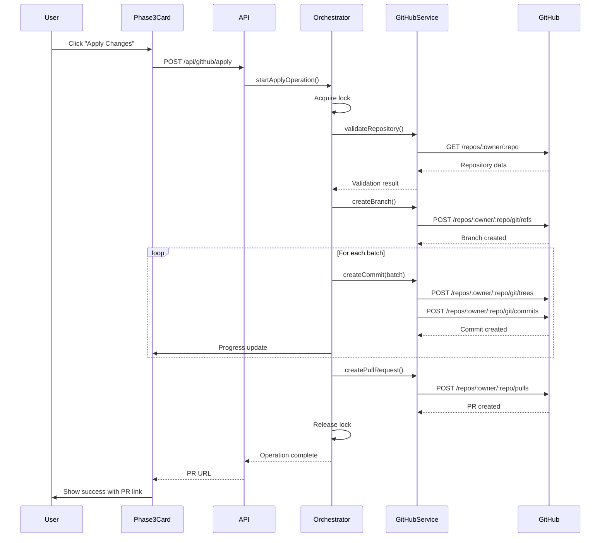

# Design Document

## Overview

This design document describes the implementation of GitHub integration for creating branches and pull requests when users apply transformation or migration changes in ReviveHub. The system will enable users to safely apply code transformations through GitHub's standard workflow, allowing for code review and collaboration before merging changes.

The integration consists of three main components:
1. **GitHub Integration Service** - Core service layer that interfaces with GitHub API using Octokit SDK
2. **Apply Changes Orchestrator** - Coordinates the end-to-end process of creating branches, commits, and pull requests
3. **Progress Tracking System** - Provides real-time feedback to users during GitHub operations

## Architecture

### High-Level Architecture

```
┌─────────────────────────────────────────────────────────────────┐
│                         Client Layer                             │
│  ┌──────────────────┐         ┌─────────────────────────────┐  │
│  │  Phase3Card.tsx  │────────▶│  ApplyChangesModal.tsx      │  │
│  │  (Results View)  │         │  (Progress & Confirmation)  │  │
│  └──────────────────┘         └─────────────────────────────┘  │
└────────────────────────────────────┬────────────────────────────┘
                                     │
                                     │ HTTP POST /api/github/apply
                                     ▼
┌─────────────────────────────────────────────────────────────────┐
│                         API Layer                                │
│  ┌──────────────────────────────────────────────────────────┐  │
│  │  /api/github/apply/route.ts                              │  │
│  │  - Validates session & permissions                       │  │
│  │  - Initiates apply operation                             │  │
│  │  - Returns operation ID for progress tracking            │  │
│  └──────────────────────────────────────────────────────────┘  │
└────────────────────────────────────┬────────────────────────────┘
                                     │
                                     ▼
┌─────────────────────────────────────────────────────────────────┐
│                      Service Layer                               │
│  ┌──────────────────────────────────────────────────────────┐  │
│  │  GitHubApplyOrchestrator                                 │  │
│  │  - Coordinates apply workflow                            │  │
│  │  - Manages operation locks                               │  │
│  │  - Emits progress events                                 │  │
│  └────────────────┬─────────────────────────────────────────┘  │
│                   │                                              │
│                   ├──────────────────────────────────────┐      │
│                   ▼                          ▼           ▼      │
│  ┌─────────────────────────┐  ┌──────────────────┐  ┌────────┐│
│  │ GitHubIntegrationService│  │ BranchNameGenerator│  │ Cache  ││
│  │ - Branch operations     │  │ - Name generation  │  │ Layer  ││
│  │ - Commit operations     │  │ - Collision check  │  │        ││
│  │ - PR operations         │  └──────────────────┘  └────────┘│
│  │ - Uses Octokit SDK      │                                    │
│  └─────────────────────────┘                                    │
└────────────────────────────────────┬────────────────────────────┘
                                     │
                                     ▼
┌─────────────────────────────────────────────────────────────────┐
│                    External Services                             │
│  ┌──────────────────────────────────────────────────────────┐  │
│  │  GitHub API (via Octokit)                                │  │
│  │  - Repository operations                                 │  │
│  │  - Git data operations (refs, trees, commits)            │  │
│  │  - Pull request operations                               │  │
│  └──────────────────────────────────────────────────────────┘  │
└─────────────────────────────────────────────────────────────────┘
```

### Component Interaction Flow



## Components and Interfaces

### 1. GitHubIntegrationService

Core service for all GitHub API operations using Octokit SDK.

```typescript
interface GitHubIntegrationService {
  // Repository operations
  validateRepository(owner: string, repo: string): Promise<RepositoryValidation>
  getDefaultBranch(owner: string, repo: string): Promise<string>
  getBranchSHA(owner: string, repo: string, branch: string): Promise<string>
  
  // Branch operations
  createBranch(owner: string, repo: string, branchName: string, sha: string): Promise<void>
  deleteBranch(owner: string, repo: string, branchName: string): Promise<void>
  branchExists(owner: string, repo: string, branchName: string): Promise<boolean>
  
  // Commit operations
  createCommit(params: CreateCommitParams): Promise<string>
  createTree(owner: string, repo: string, tree: TreeItem[], baseSHA: string): Promise<string>
  
  // Pull request operations
  createPullRequest(params: CreatePRParams): Promise<PullRequest>
  closePullRequest(owner: string, repo: string, prNumber: number): Promise<void>
  getPullRequest(owner: string, repo: string, prNumber: number): Promise<PullRequest>
}
```

### 2. GitHubApplyOrchestrator

Orchestrates the complete apply workflow with progress tracking and error handling.

```typescript
interface GitHubApplyOrchestrator {
  // Main operations
  applyChanges(request: ApplyChangesRequest): Promise<ApplyChangesResult>
  rollbackChanges(operationId: string): Promise<RollbackResult>
  
  // Progress tracking
  trackProgress(operationId: string, callback: ProgressCallback): void
  stopTracking(operationId: string, callback: ProgressCallback): void
  
  // Lock management
  acquireLock(repositoryKey: string): Promise<boolean>
  releaseLock(repositoryKey: string): void
  isLocked(repositoryKey: string): boolean
}
```

### 3. BranchNameGenerator

Generates unique, descriptive branch names following conventions.

```typescript
interface BranchNameGenerator {
  generate(params: BranchNameParams): string
  ensureUnique(baseName: string, existingBranches: string[]): string
  validate(branchName: string): boolean
}
```

## Data Models

### ApplyChangesRequest

```typescript
interface ApplyChangesRequest {
  repository: {
    owner: string
    name: string
  }
  migrationJobId: string
  acceptedFiles: string[]
  transformations: Record<string, Phase3TransformResult>
  migrationSpec: MigrationSpecification
  baseBranch?: string // Defaults to repository default branch
}
```

### ApplyChangesResult

```typescript
interface ApplyChangesResult {
  operationId: string
  status: 'success' | 'partial' | 'failed'
  branchName: string
  pullRequest: {
    number: number
    url: string
    htmlUrl: string
  }
  commits: Array<{
    sha: string
    message: string
    filesCount: number
  }>
  errors?: Array<{
    step: string
    message: string
    details?: any
  }>
}
```

### RepositoryValidation

```typescript
interface RepositoryValidation {
  exists: boolean
  accessible: boolean
  hasWriteAccess: boolean
  isArchived: boolean
  defaultBranch: string
  errors: string[]
}
```

### CreateCommitParams

```typescript
interface CreateCommitParams {
  owner: string
  repo: string
  branch: string
  message: string
  files: Array<{
    path: string
    content: string
    mode: '100644' | '100755' | '040000' | '160000' | '120000'
  }>
  parentSHA: string
}
```

### CreatePRParams

```typescript
interface CreatePRParams {
  owner: string
  repo: string
  title: string
  body: string
  head: string // Feature branch
  base: string // Base branch
  draft: boolean
}
```

### ApplyProgress

```typescript
interface ApplyProgress {
  operationId: string
  step: 'validating' | 'creating_branch' | 'committing' | 'creating_pr' | 'complete' | 'error'
  message: string
  percentage: number
  currentBatch?: number
  totalBatches?: number
  timestamp: Date
}
```


## Correctness Properties

*A property is a characteristic or behavior that should hold true across all valid executions of a system—essentially, a formal statement about what the system should do. Properties serve as the bridge between human-readable specifications and machine-verifiable correctness guarantees.*

### Property 1: Branch creation uses latest base commit

*For any* repository and base branch, when creating a feature branch, the feature branch's base SHA must equal the base branch's HEAD SHA at the time of creation.
**Validates: Requirements 1.3**

### Property 2: Branch names follow pattern

*For any* generated branch name, it must match the pattern `revivehub/migration-{framework}-{timestamp}` where timestamp is ISO 8601 format with hyphens.
**Validates: Requirements 1.2, 11.1, 11.2**

### Property 3: Branch name uniqueness

*For any* branch creation attempt where a branch with the same name exists, the system must append a unique suffix to ensure uniqueness.
**Validates: Requirements 1.4, 11.3**

### Property 4: Branch name constraints

*For any* generated branch name, it must not exceed 255 characters and must only contain alphanumeric characters, hyphens, and forward slashes.
**Validates: Requirements 11.4, 11.5**

### Property 5: All accepted files are committed

*For any* set of accepted transformation files, all files must appear in the created commits on the feature branch.
**Validates: Requirements 2.1**

### Property 6: Batch size limit

*For any* commit created during the apply operation, it must contain at most 20 files.
**Validates: Requirements 2.2, 10.1**

### Property 7: Commit message format

*For any* batch commit, the commit message must include the batch number, total batches, and file count.
**Validates: Requirements 2.3, 10.3**

### Property 8: File path preservation

*For any* transformed file, the path in the commit must match the original file path from the transformation result.
**Validates: Requirements 2.4**

### Property 9: Create vs update logic

*For any* file in a commit, if the file exists in the repository it must be updated, otherwise it must be created.
**Validates: Requirements 2.5**

### Property 10: PR creation after successful commits

*For any* successful commit operation, a pull request must be created from the feature branch to the base branch.
**Validates: Requirements 3.1**

### Property 11: PR title format

*For any* created pull request, the title must follow the pattern "ReviveHub Migration: {source} to {target}".
**Validates: Requirements 3.2**

### Property 12: PR body contains statistics

*For any* created pull request, the body must include file count, lines added, lines removed, dependencies added, and dependencies removed.
**Validates: Requirements 3.3, 8.3**

### Property 13: PR body contains warning

*For any* created pull request, the body must include a warning message about reviewing changes before merging.
**Validates: Requirements 3.4**

### Property 14: PR draft mode

*For any* created pull request, the draft flag must be set to true.
**Validates: Requirements 3.5**

### Property 15: Retry logic for network errors

*For any* network error during GitHub API operations, the system must retry up to 3 times with exponential backoff.
**Validates: Requirements 4.3**

### Property 16: Error logging

*For any* GitHub API error, an entry must be logged to the server console with request details.
**Validates: Requirements 4.5**

### Property 17: Progress emission

*For any* apply operation, progress updates must be emitted for each major step: validating, creating branch, committing, creating PR, complete.
**Validates: Requirements 5.1, 5.2**

### Property 18: Batch progress updates

*For any* commit batch being created, progress updates must include the current batch number.
**Validates: Requirements 5.3**

### Property 19: Completion progress includes PR URL

*For any* successful apply operation, the final progress update must include the pull request URL.
**Validates: Requirements 5.5**

### Property 20: Repository validation

*For any* apply operation, the system must verify the repository exists and is accessible before proceeding.
**Validates: Requirements 6.1**

### Property 21: Base branch validation

*For any* apply operation, the system must verify the base branch exists before creating the feature branch.
**Validates: Requirements 6.2**

### Property 22: Transformation validation

*For any* apply operation, all accepted files must have valid transformation results before proceeding.
**Validates: Requirements 6.5**

### Property 23: Octokit token configuration

*For any* GitHub API operation, the Octokit instance must be configured with the user's access token from the session.
**Validates: Requirements 7.2**

### Property 24: Repository metadata caching

*For any* repository metadata request within 5 minutes of a previous request, the cached result must be returned.
**Validates: Requirements 7.5**

### Property 25: PR body contains source framework

*For any* created pull request, the body must include the source framework name and version.
**Validates: Requirements 8.1**

### Property 26: PR body contains target framework

*For any* created pull request, the body must include the target framework name and version.
**Validates: Requirements 8.2**

### Property 27: PR body contains review files

*For any* created pull request with low-confidence transformations, the body must list files requiring manual review with their confidence scores.
**Validates: Requirements 8.4**

### Property 28: PR body contains ReviveHub link

*For any* created pull request, the body must include a link back to ReviveHub with the migration job ID.
**Validates: Requirements 8.5**

### Property 29: Rollback closes PR

*For any* rollback operation, the associated pull request must be closed.
**Validates: Requirements 9.1**

### Property 30: Rollback deletes branch

*For any* rollback operation, the feature branch must be deleted after closing the pull request.
**Validates: Requirements 9.2**

### Property 31: Rollback success message

*For any* successful rollback operation, a success message must be displayed confirming the branch was deleted.
**Validates: Requirements 9.5**

### Property 32: Tree API usage

*For any* multi-file commit, the GitHub tree API must be used to create the commit atomically.
**Validates: Requirements 10.2**

### Property 33: Sequential commit creation

*For any* set of commits, they must be created sequentially to maintain proper Git history.
**Validates: Requirements 10.4**

### Property 34: Lock acquisition

*For any* repository, when an apply operation starts, a lock must be acquired for that repository.
**Validates: Requirements 12.2**

### Property 35: Lock release

*For any* apply operation that completes or fails, the repository lock must be released.
**Validates: Requirements 12.4**

### Property 36: Lock expiration

*For any* repository lock, it must automatically expire after 10 minutes.
**Validates: Requirements 12.5**

## Error Handling

### Error Categories

1. **Authentication Errors**
   - Invalid or expired access token
   - Insufficient permissions
   - Action: Redirect to re-authentication

2. **Rate Limit Errors**
   - GitHub API rate limit exceeded
   - Action: Display reset time, suggest waiting, automatic retry with throttling

3. **Network Errors**
   - Connection failures
   - Timeout errors
   - Action: Retry up to 3 times with exponential backoff (1s, 2s, 4s)

4. **Validation Errors**
   - Repository not found or inaccessible
   - Branch doesn't exist
   - Repository is archived
   - Action: Display clear error message, prevent operation

5. **Conflict Errors**
   - Branch name collision (handled by appending suffix)
   - Concurrent operation in progress
   - Action: Generate unique name or display "operation in progress" error

6. **Commit Errors**
   - File too large
   - Invalid file content
   - Tree creation failure
   - Action: Stop processing, report failed batch, rollback option

### Error Response Format

```typescript
interface GitHubError {
  code: string
  message: string
  statusCode?: number
  rateLimit?: {
    limit: number
    remaining: number
    reset: Date
  }
  retryable: boolean
  userMessage: string
}
```

### Error Handling Strategy

```typescript
async function handleGitHubError(error: unknown): Promise<never> {
  if (error instanceof RequestError) {
    // Rate limit error
    if (error.status === 403 && error.response?.headers['x-ratelimit-remaining'] === '0') {
      const resetTime = new Date(
        parseInt(error.response.headers['x-ratelimit-reset']) * 1000
      )
      throw new GitHubError({
        code: 'RATE_LIMIT_EXCEEDED',
        message: `Rate limit exceeded. Resets at ${resetTime.toISOString()}`,
        statusCode: 403,
        rateLimit: {
          limit: parseInt(error.response.headers['x-ratelimit-limit']),
          remaining: 0,
          reset: resetTime,
        },
        retryable: true,
        userMessage: `GitHub API rate limit exceeded. Please wait until ${resetTime.toLocaleTimeString()} and try again.`,
      })
    }
    
    // Permission error
    if (error.status === 403) {
      throw new GitHubError({
        code: 'INSUFFICIENT_PERMISSIONS',
        message: 'Insufficient permissions to perform this operation',
        statusCode: 403,
        retryable: false,
        userMessage: 'You do not have write access to this repository. Please check your permissions.',
      })
    }
    
    // Not found error
    if (error.status === 404) {
      throw new GitHubError({
        code: 'RESOURCE_NOT_FOUND',
        message: 'Repository or resource not found',
        statusCode: 404,
        retryable: false,
        userMessage: 'The repository or resource could not be found. Please verify the repository exists.',
      })
    }
  }
  
  // Network error
  if (error instanceof Error && error.message.includes('network')) {
    throw new GitHubError({
      code: 'NETWORK_ERROR',
      message: error.message,
      retryable: true,
      userMessage: 'Network error occurred. The operation will be retried automatically.',
    })
  }
  
  // Unknown error
  throw new GitHubError({
    code: 'UNKNOWN_ERROR',
    message: error instanceof Error ? error.message : 'Unknown error',
    retryable: false,
    userMessage: 'An unexpected error occurred. Please try again or contact support.',
  })
}
```

## Testing Strategy

### Unit Testing

Unit tests will verify individual components and functions:

1. **BranchNameGenerator Tests**
   - Test pattern generation with various frameworks and timestamps
   - Test uniqueness suffix generation
   - Test validation of branch names
   - Test length constraints

2. **GitHubIntegrationService Tests**
   - Mock Octokit responses
   - Test error handling for each API operation
   - Test retry logic
   - Test caching behavior

3. **GitHubApplyOrchestrator Tests**
   - Test lock acquisition and release
   - Test progress emission
   - Test error propagation
   - Test rollback logic

### Property-Based Testing

Property-based tests will verify universal properties across many inputs using **fast-check** library for TypeScript:

1. **Branch Name Properties**
   - Generate random frameworks and timestamps
   - Verify all generated names match the pattern
   - Verify all names are within length limits
   - Verify uniqueness handling with collisions

2. **Commit Batching Properties**
   - Generate random file sets of varying sizes
   - Verify no batch exceeds 20 files
   - Verify all files are included across batches
   - Verify batch numbering is sequential

3. **PR Body Properties**
   - Generate random migration specs
   - Verify all required information is present
   - Verify formatting is consistent
   - Verify links are valid URLs

4. **Lock Management Properties**
   - Generate random operation sequences
   - Verify locks are always released
   - Verify no concurrent operations on same repository
   - Verify lock expiration works correctly

### Integration Testing

Integration tests will verify end-to-end workflows:

1. **Complete Apply Flow**
   - Create test repository
   - Generate transformation results
   - Execute apply operation
   - Verify branch, commits, and PR are created
   - Verify PR content is correct
   - Clean up test resources

2. **Rollback Flow**
   - Create branch and PR
   - Execute rollback
   - Verify PR is closed
   - Verify branch is deleted

3. **Error Scenarios**
   - Test with invalid tokens
   - Test with insufficient permissions
   - Test with archived repositories
   - Test with concurrent operations

### Test Configuration

```typescript
// vitest.config.ts additions
export default defineConfig({
  test: {
    // ... existing config
    env: {
      GITHUB_TEST_TOKEN: process.env.GITHUB_TEST_TOKEN,
      GITHUB_TEST_REPO: process.env.GITHUB_TEST_REPO,
    },
  },
})
```

