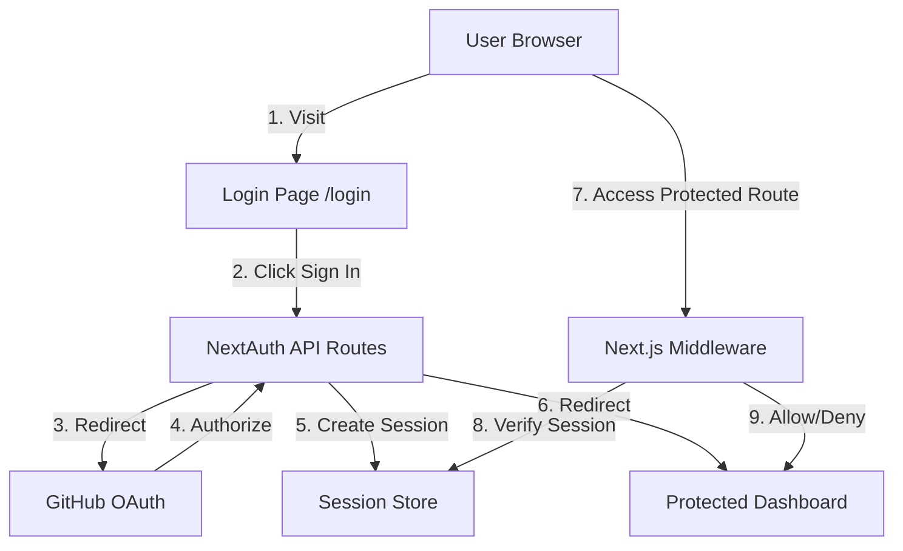

# Design Document: GitHub OAuth Authentication

## Overview

This design document outlines the implementation of GitHub OAuth authentication for ReviveHub using NextAuth.js v5 (Auth.js). The authentication system will integrate seamlessly with the existing Next.js 14 application, providing secure user authentication, session management, and protected route access.

The design leverages NextAuth.js v5's App Router support, GitHub OAuth provider, and built-in security features to create a robust authentication layer. The system will store user data and GitHub access tokens to enable repository analysis features while maintaining security best practices.

## Architecture

### High-Level Architecture



### Technology Stack

- **Framework**: Next.js 14.2.15 (App Router)
- **Authentication**: NextAuth.js v5 (Auth.js)
- **OAuth Provider**: GitHub OAuth 2.0
- **Session Storage**: JWT-based sessions (default) or database adapter
- **TypeScript**: v5.6.3
- **UI Components**: Existing Radix UI components

### Authentication Flow

1. **Initial Request**: User visits protected route or clicks sign-in
2. **Redirect to Login**: Middleware redirects unauthenticated users to /login
3. **OAuth Initiation**: User clicks "Sign in with GitHub" button
4. **GitHub Authorization**: NextAuth redirects to GitHub OAuth page
5. **OAuth Callback**: GitHub redirects back with authorization code
6. **Token Exchange**: NextAuth exchanges code for access token
7. **Profile Fetch**: NextAuth retrieves user profile from GitHub API
8. **Session Creation**: NextAuth creates encrypted session with user data
9. **Redirect to Dashboard**: User is redirected to originally requested page or dashboard

## Components and Interfaces

### 1. NextAuth Configuration

**File**: `app/api/auth/[...nextauth]/route.ts`

```typescript
import NextAuth from "next-auth"
import GitHub from "next-auth/providers/github"
import type { NextAuthConfig } from "next-auth"

export const authConfig: NextAuthConfig = {
  providers: [
    GitHub({
      clientId: process.env.GITHUB_ID!,
      clientSecret: process.env.GITHUB_SECRET!,
      authorization: {
        params: {
          scope: "read:user user:email repo"
        }
      }
    })
  ],
  pages: {
    signIn: "/login",
    error: "/login"
  },
  callbacks: {
    authorized({ auth, request: { nextUrl } }) {
      const isLoggedIn = !!auth?.user
      const isOnDashboard = nextUrl.pathname.startsWith("/dashboard")
      
      if (isOnDashboard) {
        if (isLoggedIn) return true
        return false // Redirect to login
      } else if (isLoggedIn) {
        return Response.redirect(new URL("/dashboard", nextUrl))
      }
      return true
    },
    async jwt({ token, account, profile }) {
      // Persist GitHub access token and user data
      if (account && profile) {
        token.accessToken = account.access_token
        token.refreshToken = account.refresh_token
        token.expiresAt = account.expires_at
        token.githubId = profile.id
      }
      return token
    },
    async session({ session, token }) {
      // Add custom fields to session
      if (session.user) {
        session.user.id = token.githubId as string
        session.accessToken = token.accessToken as string
        session.expiresAt = token.expiresAt as number
      }
      return session
    }
  },
  session: {
    strategy: "jwt",
    maxAge: 30 * 24 * 60 * 60 // 30 days
  },
  secret: process.env.NEXTAUTH_SECRET
}

const handler = NextAuth(authConfig)
export { handler as GET, handler as POST }
```

### 2. Type Definitions

**File**: `types/auth.ts`

```typescript
import { DefaultSession } from "next-auth"

declare module "next-auth" {
  interface Session {
    user: {
      id: string
      githubId?: string
    } & DefaultSession["user"]
    accessToken?: string
    expiresAt?: number
  }

  interface User {
    githubId?: string
    linkedRepositoriesCount?: number
  }
}

declare module "next-auth/jwt" {
  interface JWT {
    accessToken?: string
    refreshToken?: string
    expiresAt?: number
    githubId?: string
  }
}

export interface AuthUser {
  id: string
  name: string | null
  email: string | null
  image: string | null
  githubId: string
  accessToken: string
  linkedRepositoriesCount: number
}
```

### 3. Middleware for Protected Routes

**File**: `middleware.ts`

```typescript
export { auth as middleware } from "@/auth"

export const config = {
  matcher: [
    "/dashboard/:path*",
    "/api/repositories/:path*",
    "/api/analysis/:path*"
  ]
}
```

### 4. Auth Helper Functions

**File**: `lib/auth.ts`

```typescript
import { auth } from "@/auth"
import { redirect } from "next/navigation"

export async function getSession() {
  return await auth()
}

export async function getCurrentUser() {
  const session = await getSession()
  return session?.user
}

export async function requireAuth() {
  const session = await getSession()
  if (!session?.user) {
    redirect("/login")
  }
  return session
}

export async function getGitHubToken() {
  const session = await getSession()
  if (!session?.accessToken) {
    throw new Error("No GitHub access token available")
  }
  return session.accessToken
}

export function isTokenExpiringSoon(expiresAt: number): boolean {
  const oneDayInSeconds = 24 * 60 * 60
  const currentTime = Math.floor(Date.now() / 1000)
  return expiresAt - currentTime < oneDayInSeconds
}
```

### 5. Login Page Component

**File**: `app/login/page.tsx`

```typescript
import { redirect } from "next/navigation"
import { getSession } from "@/lib/auth"
import { LoginButton } from "@/components/auth/LoginButton"

export default async function LoginPage({
  searchParams
}: {
  searchParams: { error?: string; callbackUrl?: string }
}) {
  const session = await getSession()
  
  if (session?.user) {
    redirect("/dashboard")
  }

  return (
    <div className="flex min-h-screen items-center justify-center">
      <div className="w-full max-w-md space-y-8 p-8">
        <div className="text-center">
          <h1 className="text-4xl font-bold">ReviveHub</h1>
          <p className="mt-2 text-gray-600">
            AI-Powered Code Modernization
          </p>
        </div>
        
        {searchParams.error && (
          <div className="rounded-md bg-red-50 p-4">
            <p className="text-sm text-red-800">
              {getErrorMessage(searchParams.error)}
            </p>
          </div>
        )}
        
        <LoginButton callbackUrl={searchParams.callbackUrl} />
      </div>
    </div>
  )
}

function getErrorMessage(error: string): string {
  switch (error) {
    case "OAuthAccountNotLinked":
      return "This email is already associated with another account."
    case "OAuthCallback":
      return "Authentication cancelled or failed. Please try again."
    case "AccessDenied":
      return "Access denied. Please authorize the application."
    default:
      return "An error occurred during authentication. Please try again."
  }
}
```

### 6. Login Button Component

**File**: `components/auth/LoginButton.tsx`

```typescript
"use client"

import { signIn } from "next-auth/react"
import { Button } from "@/components/ui/button"
import { Github } from "lucide-react"

interface LoginButtonProps {
  callbackUrl?: string
}

export function LoginButton({ callbackUrl }: LoginButtonProps) {
  const handleSignIn = () => {
    signIn("github", { callbackUrl: callbackUrl || "/dashboard" })
  }

  return (
    <Button
      onClick={handleSignIn}
      className="w-full"
      size="lg"
    >
      <Github className="mr-2 h-5 w-5" />
      Sign in with GitHub
    </Button>
  )
}
```

### 7. Dashboard Layout with Auth

**File**: `app/dashboard/layout.tsx`

```typescript
import { requireAuth } from "@/lib/auth"
import { UserNav } from "@/components/auth/UserNav"

export default async function DashboardLayout({
  children
}: {
  children: React.ReactNode
}) {
  const session = await requireAuth()

  return (
    <div className="min-h-screen">
      <header className="border-b">
        <div className="container flex h-16 items-center justify-between">
          <h1 className="text-xl font-bold">ReviveHub</h1>
          <UserNav user={session.user} />
        </div>
      </header>
      <main className="container py-6">{children}</main>
    </div>
  )
}
```

### 8. User Navigation Component

**File**: `components/auth/UserNav.tsx`

```typescript
"use client"

import { signOut } from "next-auth/react"
import {
  DropdownMenu,
  DropdownMenuContent,
  DropdownMenuItem,
  DropdownMenuLabel,
  DropdownMenuSeparator,
  DropdownMenuTrigger,
} from "@/components/ui/dropdown-menu"
import { Button } from "@/components/ui/button"
import { Avatar, AvatarFallback, AvatarImage } from "@/components/ui/avatar"
import { LogOut, User } from "lucide-react"

interface UserNavProps {
  user: {
    name?: string | null
    email?: string | null
    image?: string | null
  }
}

export function UserNav({ user }: UserNavProps) {
  const initials = user.name
    ?.split(" ")
    .map((n) => n[0])
    .join("")
    .toUpperCase() || "U"

  return (
    <DropdownMenu>
      <DropdownMenuTrigger asChild>
        <Button variant="ghost" className="relative h-10 w-10 rounded-full">
          <Avatar>
            <AvatarImage src={user.image || ""} alt={user.name || ""} />
            <AvatarFallback>{initials}</AvatarFallback>
          </Avatar>
        </Button>
      </DropdownMenuTrigger>
      <DropdownMenuContent align="end">
        <DropdownMenuLabel>
          <div className="flex flex-col space-y-1">
            <p className="text-sm font-medium">{user.name}</p>
            <p className="text-xs text-muted-foreground">{user.email}</p>
          </div>
        </DropdownMenuLabel>
        <DropdownMenuSeparator />
        <DropdownMenuItem onClick={() => signOut({ callbackUrl: "/login" })}>
          <LogOut className="mr-2 h-4 w-4" />
          Sign out
        </DropdownMenuItem>
      </DropdownMenuContent>
    </DropdownMenu>
  )
}
```

### 9. Session Provider Wrapper

**File**: `components/auth/SessionProvider.tsx`

```typescript
"use client"

import { SessionProvider as NextAuthSessionProvider } from "next-auth/react"

export function SessionProvider({ children }: { children: React.ReactNode }) {
  return <NextAuthSessionProvider>{children}</NextAuthSessionProvider>
}
```

### 10. GitHub Service Integration

**File**: `services/github.ts` (Updated)

```typescript
import { getGitHubToken } from "@/lib/auth"

export class GitHubService {
  private baseURL = "https://api.github.com"

  async getAuthenticatedUser() {
    const token = await getGitHubToken()
    const response = await fetch(`${this.baseURL}/user`, {
      headers: {
        Authorization: `Bearer ${token}`,
        Accept: "application/vnd.github.v3+json"
      }
    })
    
    if (!response.ok) {
      throw new Error("Failed to fetch user data")
    }
    
    return response.json()
  }

  async getUserRepositories() {
    const token = await getGitHubToken()
    const response = await fetch(`${this.baseURL}/user/repos?per_page=100`, {
      headers: {
        Authorization: `Bearer ${token}`,
        Accept: "application/vnd.github.v3+json"
      }
    })
    
    if (!response.ok) {
      throw new Error("Failed to fetch repositories")
    }
    
    return response.json()
  }

  async getRepository(owner: string, repo: string) {
    const token = await getGitHubToken()
    const response = await fetch(`${this.baseURL}/repos/${owner}/${repo}`, {
      headers: {
        Authorization: `Bearer ${token}`,
        Accept: "application/vnd.github.v3+json"
      }
    })
    
    if (!response.ok) {
      throw new Error("Failed to fetch repository")
    }
    
    return response.json()
  }
}
```

## Data Models

### Session Data Structure

```typescript
{
  user: {
    id: string              // GitHub user ID
    name: string            // User's display name
    email: string           // User's email
    image: string           // Avatar URL
    githubId: string        // GitHub user ID (duplicate for clarity)
  },
  accessToken: string       // GitHub OAuth access token
  expiresAt: number         // Token expiration timestamp
  expires: string           // Session expiration ISO string
}
```

### JWT Token Structure

```typescript
{
  sub: string               // User ID
  name: string              // User name
  email: string             // User email
  picture: string           // Avatar URL
  accessToken: string       // GitHub access token
  refreshToken: string      // GitHub refresh token
  expiresAt: number         // Token expiration timestamp
  githubId: string          // GitHub user ID
  iat: number               // Issued at
  exp: number               // JWT expiration
  jti: string               // JWT ID
}
```

### User Database Schema (Optional - for database adapter)

```typescript
interface User {
  id: string
  name: string | null
  email: string | null
  emailVerified: Date | null
  image: string | null
  githubId: string
  linkedRepositoriesCount: number
  createdAt: Date
  updatedAt: Date
}

interface Account {
  id: string
  userId: string
  type: string
  provider: string
  providerAccountId: string
  refresh_token: string | null
  access_token: string | null
  expires_at: number | null
  token_type: string | null
  scope: string | null
  id_token: string | null
  session_state: string | null
}

interface Session {
  id: string
  sessionToken: string
  userId: string
  expires: Date
}
```

## Error Handling

### Error Types and Handling Strategy

1. **OAuth Errors**
   - `OAuthAccountNotLinked`: Display message, suggest using correct provider
   - `OAuthCallback`: Display generic error, log details server-side
   - `AccessDenied`: Inform user they denied access

2. **Token Errors**
   - Expired token: Attempt refresh, fallback to re-authentication
   - Invalid token: Clear session, redirect to login
   - Missing token: Redirect to login

3. **Network Errors**
   - GitHub API unavailable: Display retry option with exponential backoff
   - Timeout: Display user-friendly message, log for monitoring

4. **Session Errors**
   - Invalid session: Clear and redirect to login
   - Session expired: Display message, redirect to login
   - CSRF validation failed: Log security event, reject request

### Error Handling Implementation

```typescript
// lib/errors.ts
export class AuthError extends Error {
  constructor(
    message: string,
    public code: string,
    public statusCode: number = 500
  ) {
    super(message)
    this.name = "AuthError"
  }
}

export class TokenExpiredError extends AuthError {
  constructor() {
    super("Token has expired", "TOKEN_EXPIRED", 401)
  }
}

export class InvalidTokenError extends AuthError {
  constructor() {
    super("Invalid token", "INVALID_TOKEN", 401)
  }
}

export function handleAuthError(error: unknown): string {
  if (error instanceof AuthError) {
    console.error(`Auth Error [${error.code}]:`, error.message)
    return error.message
  }
  
  console.error("Unknown auth error:", error)
  return "An unexpected error occurred. Please try again."
}
```

## Testing Strategy

### Unit Tests

1. **Auth Helper Functions**
   - Test `getSession()` with valid/invalid sessions
   - Test `requireAuth()` redirect behavior
   - Test `isTokenExpiringSoon()` with various timestamps
   - Test `getGitHubToken()` error handling

2. **Error Handling**
   - Test error message mapping
   - Test error logging
   - Test error boundary behavior

### Integration Tests

1. **OAuth Flow**
   - Test complete sign-in flow
   - Test callback handling
   - Test session creation
   - Test token storage

2. **Protected Routes**
   - Test middleware authentication checks
   - Test redirect to login
   - Test redirect after login
   - Test access with valid session

3. **Session Management**
   - Test session persistence
   - Test session expiration
   - Test sign-out flow
   - Test concurrent sessions

### End-to-End Tests

1. **User Journey**
   - Visit protected route → redirect to login → sign in → access dashboard
   - Sign in → navigate app → sign out → verify logged out
   - Sign in → close browser → reopen → verify still logged in
   - Token expiration → automatic refresh → continued access

2. **Error Scenarios**
   - Deny OAuth access → see error message
   - Network failure during auth → see retry option
   - Session expires during use → redirect to login

### Security Tests

1. **CSRF Protection**
   - Verify CSRF tokens on state-changing operations
   - Test invalid CSRF token rejection

2. **Token Security**
   - Verify tokens are not exposed in client-side code
   - Verify secure cookie flags
   - Verify HttpOnly cookie flags

3. **Session Security**
   - Test session hijacking prevention
   - Verify session invalidation on sign-out
   - Test concurrent session handling

## Security Considerations

### Token Storage

- **Access tokens**: Stored in JWT, encrypted by NextAuth
- **Refresh tokens**: Stored in JWT, encrypted by NextAuth
- **Session cookies**: HttpOnly, Secure, SameSite=lax
- **Environment variables**: Never committed, use .env.local

### CSRF Protection

- NextAuth automatically generates and validates CSRF tokens
- All state-changing operations require valid CSRF token
- Tokens are tied to user session

### Session Security

- JWT encryption using NEXTAUTH_SECRET
- 30-day session expiration
- Automatic session refresh on activity
- Secure cookie transmission (HTTPS in production)

### OAuth Security

- State parameter validation
- Nonce validation for OIDC
- Scope limitation (read:user, user:email, repo)
- Redirect URI validation

### Best Practices

1. Use environment variables for all secrets
2. Implement rate limiting on auth endpoints
3. Log authentication events for monitoring
4. Use HTTPS in production
5. Implement proper error handling without exposing sensitive data
6. Regular security audits of dependencies
7. Monitor for suspicious authentication patterns

## Environment Variables

Required environment variables for authentication:

```bash
# NextAuth Configuration
NEXTAUTH_URL=http://localhost:3000
NEXTAUTH_SECRET=<generate-with-openssl-rand-base64-32>

# GitHub OAuth
GITHUB_ID=<github-oauth-app-client-id>
GITHUB_SECRET=<github-oauth-app-client-secret>

# Optional: Database (if using database adapter)
DATABASE_URL=<database-connection-string>
```

## Deployment Considerations

### Production Checklist

1. Set `NEXTAUTH_URL` to production domain
2. Generate strong `NEXTAUTH_SECRET`
3. Configure GitHub OAuth app with production callback URL
4. Enable HTTPS
5. Set secure cookie flags
6. Configure CORS if needed
7. Set up monitoring and logging
8. Implement rate limiting
9. Configure session storage (JWT or database)
10. Test token refresh flow

### Scaling Considerations

- JWT sessions scale horizontally without shared state
- Database adapter required for multi-server session sharing
- Consider Redis for session storage at scale
- Implement caching for GitHub API responses
- Monitor token refresh patterns

## Migration Path

Since this is a new feature, no migration is needed. However, future considerations:

1. If switching from JWT to database sessions, implement gradual migration
2. If adding additional OAuth providers, ensure user linking works correctly
3. If changing session duration, communicate to users
4. Maintain backward compatibility for API clients

## Dependencies

New dependencies to add:

```json
{
  "dependencies": {
    "next-auth": "^5.0.0-beta.4",
    "@auth/core": "^0.18.0"
  },
  "devDependencies": {
    "@types/next-auth": "^3.15.0"
  }
}
```

## Performance Considerations

1. **Session Validation**: Middleware runs on every request to protected routes
   - JWT validation is fast (no database lookup)
   - Consider caching session data for repeated checks

2. **Token Refresh**: Implement background refresh to avoid blocking user requests

3. **GitHub API Calls**: 
   - Cache user profile data
   - Implement rate limit handling
   - Use conditional requests with ETags

4. **Cookie Size**: JWT tokens can be large
   - Monitor cookie size
   - Consider database sessions if JWT grows too large
