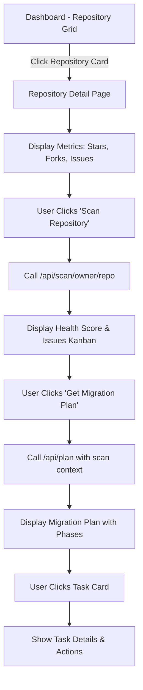

# Design Document

## Overview

This design document outlines the technical architecture for transforming the ReviveHub dashboard into a comprehensive repository analysis and migration planning workflow. The solution introduces a dedicated repository detail page that guides users through three key stages: repository overview, health scanning with issue visualization, and AI-powered migration planning.

The design leverages existing components from `components/planner`, services from `lib/planner`, AI capabilities from `lib/ai`, and MCP server tools from `mcp/claude-server` to create a cohesive user experience.

## Architecture

### High-Level Flow



### Component Hierarchy

```
app/
├── dashboard/
│   ├── page.tsx (Updated - Repository Grid)
│   └── [owner]/
│       └── [repo]/
│           └── page.tsx (New - Repository Detail Page)
│
components/
├── dashboard/
│   ├── RepositoryCard.tsx (Updated - Add navigation)
│   └── RepositoryList.tsx (Existing)
├── repository/
│   ├── MetricCards.tsx (New)
│   ├── ScanButton.tsx (New)
│   ├── IssueKanban.tsx (New)
│   ├── IssueCard.tsx (New)
│   └── MigrationPlanButton.tsx (New)
└── planner/
    ├── MigrationPlanView.tsx (Existing - Reuse)
    ├── PhaseTimeline.tsx (Existing - Reuse)
    ├── PhaseDetails.tsx (Existing - Reuse)
    ├── AIInsights.tsx (Existing - Reuse)
    └── TaskList.tsx (Existing - Reuse)
```

### API Architecture

```
app/api/
├── scan/
│   └── [owner]/
│       └── [repo]/
│           └── route.ts (Existing - Returns AnalysisReport)
├── plan/
│   └── route.ts (Updated - Enhanced implementation)
└── analyze/
    └── route.ts (Existing - Pattern detection)
```

## Components and Interfaces

### 1. Repository Detail Page (`app/dashboard/[owner]/[repo]/page.tsx`)

**Purpose**: Main orchestration component for the repository detail workflow.

**Props**: None (uses Next.js dynamic route params)

**State Management**:
```typescript
interface RepositoryDetailState {
  repository: Repository | null
  isLoadingRepo: boolean
  scanResults: AnalysisReport | null
  isScanning: boolean
  scanError: string | null
  migrationPlan: EnhancedMigrationPlan | null
  isGeneratingPlan: boolean
  planError: string | null
}
```

**Key Responsibilities**:
- Fetch repository metadata from GitHub API
- Coordinate scan and plan generation workflows
- Manage loading and error states
- Render child components with appropriate data

**Implementation Notes**:
- Use Next.js server components for initial repository fetch
- Client components for interactive scan/plan actions
- Implement optimistic UI updates during async operations

### 2. MetricCards Component (`components/repository/MetricCards.tsx`)

**Purpose**: Display repository statistics in a visually appealing card layout.

**Props**:
```typescript
interface MetricCardsProps {
  stars: number
  forks: number
  openIssues: number
  language?: string | null
}
```

**Design**:
- Three-column grid on medium+ screens, stacked on mobile
- Gradient backgrounds matching ReviveHub theme (purple/orange)
- Icon + number + label layout
- Animated count-up effect on mount

### 3. ScanButton Component (`components/repository/ScanButton.tsx`)

**Purpose**: Trigger repository health scan with loading feedback.

**Props**:
```typescript
interface ScanButtonProps {
  owner: string
  repo: string
  onScanComplete: (results: AnalysisReport) => void
  onScanError: (error: string) => void
  disabled?: boolean
}
```

**Behavior**:
- Display loading spinner during scan
- Show progress message ("Analyzing dependencies...", "Detecting patterns...")
- Handle rate limit errors gracefully
- Disable button during scan

### 4. IssueKanban Component (`components/repository/IssueKanban.tsx`)

**Purpose**: Display detected issues in a Kanban-style three-column layout.

**Props**:
```typescript
interface IssueKanbanProps {
  issues: Issue[]
  healthScore: HealthScore
}
```

**Design**:
- Three columns: "Minor", "Moderate", "Major"
- Horizontal scroll on mobile
- Drag-and-drop disabled (read-only view)
- Column headers show count badges
- Empty state for columns with no issues

**Issue Categorization Logic**:
```typescript
function categorizeIssues(issues: Issue[]): {
  minor: Issue[]
  moderate: Issue[]
  major: Issue[]
} {
  return {
    minor: issues.filter(i => i.severity === 'info'),
    moderate: issues.filter(i => i.severity === 'warning'),
    major: issues.filter(i => i.severity === 'critical')
  }
}
```

### 5. IssueCard Component (`components/repository/IssueCard.tsx`)

**Purpose**: Display individual issue details within Kanban columns.

**Props**:
```typescript
interface IssueCardProps {
  issue: Issue
  severity: 'minor' | 'moderate' | 'major'
}
```

**Design**:
- Severity-based color coding (blue/yellow/red)
- Expandable to show affected files
- Category badge
- Truncated description with "Show more" link

### 6. MigrationPlanButton Component (`components/repository/MigrationPlanButton.tsx`)

**Purpose**: Trigger migration plan generation with context from scan results.

**Props**:
```typescript
interface MigrationPlanButtonProps {
  scanResults: AnalysisReport
  owner: string
  repo: string
  onPlanGenerated: (plan: EnhancedMigrationPlan) => void
  onPlanError: (error: string) => void
  disabled?: boolean
}
```

**Behavior**:
- Extract source stack from scan results
- Allow user to select target framework (modal/dropdown)
- Show loading state with progress messages
- Handle AI service errors

### 7. Updated RepositoryCard (`components/dashboard/RepositoryCard.tsx`)

**Changes**:
- Wrap card content in Next.js `Link` component
- Navigate to `/dashboard/[owner]/[repo]` on click
- Remove inline scan functionality (move to detail page)
- Keep visual design consistent

## Data Models

### Scan Request/Response

**Request**: GET `/api/scan/[owner]/[repo]`

**Response**:
```typescript
interface ScanResponse {
  success: boolean
  data: AnalysisReport
  rateLimit: {
    remaining: number
    limit: number
    reset: Date
  }
}

// AnalysisReport from lib/scanner/types/index.ts
interface AnalysisReport {
  repository: {
    owner: string
    name: string
    analyzedAt: Date
    commitSha: string
  }
  languages: LanguageDetectionResult
  frameworks: FrameworkDetectionResult
  buildTools: BuildToolDetectionResult
  dependencies: DependencyAnalysisResult
  healthScore: HealthScore
  issues: Issue[]
  recommendations: Recommendation[]
  metadata: {
    analysisVersion: string
    completionStatus: 'complete' | 'partial'
    errors: string[]
  }
}
```

### Plan Request/Response

**Request**: POST `/api/plan`

**Body**:
```typescript
interface PlanRequest {
  owner: string
  repo: string
  source: SourceStack
  target: TargetStack
  patterns: DetectedPattern[]
  codebaseStats: {
    totalFiles: number
    totalLines: number
    testCoverage: number
  }
  customization?: Partial<PlanCustomization>
  enableAI?: boolean
}
```

**Response**:
```typescript
interface PlanResponse {
  plan: EnhancedMigrationPlan
  timeline: {
    sequential: number
    parallel: number
    batches: string[][]
  }
  validation: {
    valid: boolean
    errors: string[]
  }
}
```

### Source Stack Extraction

Transform `AnalysisReport` into `SourceStack`:

```typescript
function extractSourceStack(report: AnalysisReport): SourceStack {
  const primaryFramework = report.frameworks.frontend[0] || report.frameworks.backend[0]
  const primaryLanguage = report.languages.primaryLanguage
  
  return {
    framework: primaryFramework?.name || 'Unknown',
    version: primaryFramework?.version || '0.0.0',
    language: primaryLanguage?.name || 'JavaScript',
    dependencies: extractDependencyMap(report.dependencies),
    patterns: extractPatternNames(report.issues)
  }
}

function extractDependencyMap(deps: DependencyAnalysisResult): Record<string, string> {
  const map: Record<string, string> = {}
  deps.dependencies.forEach(dep => {
    map[dep.name] = dep.installedVersion
  })
  return map
}

function extractPatternNames(issues: Issue[]): string[] {
  return issues.map(issue => issue.category)
}
```

### Pattern Detection from Issues

Convert `Issue[]` to `DetectedPattern[]`:

```typescript
function convertIssuesToPatterns(issues: Issue[]): DetectedPattern[] {
  return issues.map((issue, index) => ({
    id: `pattern-${index}`,
    name: issue.title,
    category: mapCategoryToPatternCategory(issue.category),
    severity: mapSeverityToPatternSeverity(issue.severity),
    occurrences: 1,
    affectedFiles: issue.affectedFiles || [],
    description: issue.description,
    automated: false // Conservative default
  }))
}

function mapCategoryToPatternCategory(category: string): 'dependency' | 'structural' | 'component' | 'documentation' {
  const categoryMap: Record<string, DetectedPattern['category']> = {
    'dependencies': 'dependency',
    'architecture': 'structural',
    'components': 'component',
    'documentation': 'documentation'
  }
  return categoryMap[category.toLowerCase()] || 'structural'
}

function mapSeverityToPatternSeverity(severity: 'critical' | 'warning' | 'info'): 'low' | 'medium' | 'high' {
  const severityMap = {
    'info': 'low' as const,
    'warning': 'medium' as const,
    'critical': 'high' as const
  }
  return severityMap[severity]
}
```

## API Implementation Details

### Enhanced `/api/plan` Route

**Current State**: Basic implementation with placeholder logic

**Required Enhancements**:

1. **Request Validation**:
```typescript
import { z } from 'zod'

const PlanRequestSchema = z.object({
  owner: z.string().min(1),
  repo: z.string().min(1),
  source: z.object({
    framework: z.string(),
    version: z.string(),
    language: z.string(),
    dependencies: z.record(z.string()),
    patterns: z.array(z.string())
  }),
  target: z.object({
    framework: z.string(),
    version: z.string(),
    language: z.string(),
    dependencies: z.record(z.string()),
    features: z.array(z.string())
  }),
  patterns: z.array(z.any()),
  codebaseStats: z.object({
    totalFiles: z.number(),
    totalLines: z.number(),
    testCoverage: z.number()
  }),
  customization: z.any().optional(),
  enableAI: z.boolean().optional().default(true)
})
```

2. **MCP Integration**:
```typescript
import { ClaudeAnalyzerTools } from '@/mcp/claude-server/src/tools'

async function enhanceWithMCP(
  source: SourceStack,
  target: TargetStack,
  codeSnippets: string[]
): Promise<{
  patterns: DetectedPattern[]
  insights: AIInsight[]
}> {
  const mcpTools = new ClaudeAnalyzerTools(process.env.ANTHROPIC_API_KEY!)
  
  // Detect patterns using MCP
  const patternDetection = await mcpTools.detectPatterns({
    codebase: codeSnippets.join('\n\n'),
    patterns: source.patterns
  })
  
  // Generate migration insights
  const migrationPlan = await mcpTools.generateMigrationPlan({
    source: JSON.stringify(source),
    target: JSON.stringify(target)
  })
  
  return {
    patterns: convertMCPPatterns(patternDetection),
    insights: extractInsights(migrationPlan)
  }
}
```

3. **Pattern Detector Integration**:
```typescript
import { PatternDetector } from '@/lib/ai/pattern-detector'

async function detectCodePatterns(
  codeSnippets: string[],
  language: string
): Promise<DetectedPattern[]> {
  const detector = new PatternDetector(process.env.ANTHROPIC_API_KEY!)
  
  const allPatterns: DetectedPattern[] = []
  
  for (const snippet of codeSnippets) {
    const patterns = await detector.detectLegacyPatterns(snippet, language)
    allPatterns.push(...patterns)
  }
  
  return deduplicatePatterns(allPatterns)
}
```

4. **Complete Implementation**:
```typescript
export async function POST(request: NextRequest) {
  try {
    const session = await auth()
    if (!session?.user) {
      return NextResponse.json({ error: 'Unauthorized' }, { status: 401 })
    }

    const body = await request.json()
    const validated = PlanRequestSchema.parse(body)
    
    // Initialize services
    const planner = new MigrationPlanner()
    
    // Enhance patterns with MCP if available
    let enhancedPatterns = validated.patterns
    if (process.env.ANTHROPIC_API_KEY && validated.enableAI) {
      const mcpEnhancement = await enhanceWithMCP(
        validated.source,
        validated.target,
        [] // Would fetch code snippets from GitHub
      )
      enhancedPatterns = [...validated.patterns, ...mcpEnhancement.patterns]
    }
    
    // Generate migration plan
    const plan = await planner.createPlan(
      validated.source,
      validated.target,
      enhancedPatterns,
      validated.codebaseStats,
      validated.customization,
      validated.enableAI
    )
    
    // Optimize and validate
    const optimizedPlan = await planner.optimizePlan(plan)
    const validation = await planner.validatePlan(optimizedPlan)
    
    if (!validation.valid) {
      return NextResponse.json(
        { error: 'Invalid plan', details: validation.errors },
        { status: 400 }
      )
    }
    
    // Generate timeline
    const timeline = planner.generateExecutionTimeline(optimizedPlan)
    
    return NextResponse.json({
      plan: optimizedPlan,
      timeline,
      validation
    })
    
  } catch (error) {
    console.error('Plan generation error:', error)
    
    if (error instanceof z.ZodError) {
      return NextResponse.json(
        { error: 'Invalid request', details: error.errors },
        { status: 400 }
      )
    }
    
    return NextResponse.json(
      { error: 'Plan generation failed', details: String(error) },
      { status: 500 }
    )
  }
}
```

## Error Handling

### Scan Errors

**Rate Limit Exceeded**:
```typescript
if (error.statusCode === 429) {
  return {
    error: 'Rate limit exceeded',
    message: `GitHub API rate limit reached. Resets at ${error.rateLimit?.reset}`,
    retryAfter: error.rateLimit?.reset
  }
}
```

**Repository Not Found**:
```typescript
if (error.statusCode === 404) {
  return {
    error: 'Repository not found',
    message: 'The repository does not exist or you do not have access to it'
  }
}
```

**Scan Timeout**:
```typescript
if (error.message.includes('timeout')) {
  return {
    error: 'Scan timeout',
    message: 'Repository analysis took too long. Try again or contact support for large repositories.'
  }
}
```

### Plan Generation Errors

**AI Service Unavailable**:
```typescript
if (!process.env.ANTHROPIC_API_KEY) {
  return {
    error: 'AI service not configured',
    message: 'Migration planning requires AI service configuration',
    fallback: 'basic-plan' // Generate plan without AI enhancement
  }
}
```

**Invalid Source/Target Stack**:
```typescript
if (!source.framework || !target.framework) {
  return {
    error: 'Invalid stack configuration',
    message: 'Both source and target frameworks must be specified'
  }
}
```

**Pattern Detection Failure**:
```typescript
try {
  const patterns = await detectPatterns(code)
} catch (error) {
  console.warn('Pattern detection failed, using scan results only')
  // Fallback to patterns from scan results
  const patterns = convertIssuesToPatterns(scanResults.issues)
}
```

## Testing Strategy

### Unit Tests

**Component Tests**:
- `MetricCards.test.tsx`: Verify correct rendering of metrics
- `IssueKanban.test.tsx`: Test issue categorization and rendering
- `IssueCard.test.tsx`: Test expand/collapse and severity styling
- `ScanButton.test.tsx`: Test loading states and error handling

**Utility Tests**:
- `extractSourceStack.test.ts`: Verify correct transformation of AnalysisReport
- `convertIssuesToPatterns.test.ts`: Test issue-to-pattern conversion
- `categorizeIssues.test.ts`: Test severity-based categorization

### Integration Tests

**API Route Tests**:
```typescript
describe('/api/plan', () => {
  it('should generate migration plan with valid input', async () => {
    const response = await POST(mockRequest)
    expect(response.status).toBe(200)
    const data = await response.json()
    expect(data.plan).toBeDefined()
    expect(data.plan.phases).toHaveLength(4)
  })
  
  it('should handle missing AI key gracefully', async () => {
    delete process.env.ANTHROPIC_API_KEY
    const response = await POST(mockRequest)
    expect(response.status).toBe(200)
    // Should still return plan without AI enhancement
  })
  
  it('should validate request schema', async () => {
    const invalidRequest = { ...mockRequest, source: null }
    const response = await POST(invalidRequest)
    expect(response.status).toBe(400)
  })
})
```

**End-to-End Tests**:
```typescript
describe('Repository Detail Flow', () => {
  it('should navigate from dashboard to detail page', async () => {
    await page.goto('/dashboard')
    await page.click('[data-testid="repo-card-0"]')
    await expect(page).toHaveURL(/\/dashboard\/.*\/.*/)
  })
  
  it('should scan repository and display issues', async () => {
    await page.goto('/dashboard/owner/repo')
    await page.click('[data-testid="scan-button"]')
    await page.waitForSelector('[data-testid="issue-kanban"]')
    const issues = await page.$$('[data-testid="issue-card"]')
    expect(issues.length).toBeGreaterThan(0)
  })
  
  it('should generate and display migration plan', async () => {
    // Assumes scan is complete
    await page.click('[data-testid="get-plan-button"]')
    await page.waitForSelector('[data-testid="migration-plan"]')
    const phases = await page.$$('[data-testid="phase-card"]')
    expect(phases.length).toBeGreaterThan(0)
  })
})
```

### Manual Testing Checklist

- [ ] Repository grid displays correctly on mobile/tablet/desktop
- [ ] Clicking repository card navigates to detail page
- [ ] Metric cards show correct values from GitHub API
- [ ] Scan button triggers API call and shows loading state
- [ ] Health score displays after successful scan
- [ ] Issues are correctly categorized by severity
- [ ] Kanban columns scroll horizontally on mobile
- [ ] "Get Migration Plan" button appears after scan
- [ ] Plan generation shows progress indicators
- [ ] Migration plan displays with all phases
- [ ] Task cards are clickable and show details
- [ ] AI insights display when available
- [ ] Error messages are user-friendly
- [ ] Back navigation returns to dashboard
- [ ] Rate limit errors handled gracefully

## Performance Considerations

### Optimization Strategies

**1. Code Splitting**:
```typescript
// Lazy load heavy components
const MigrationPlanView = dynamic(
  () => import('@/components/planner/MigrationPlanView'),
  { loading: () => <PlanLoadingSkeleton /> }
)
```

**2. Caching**:
- Cache scan results in localStorage for 5 minutes
- Cache repository metadata in Next.js cache
- Use SWR for client-side data fetching

**3. Pagination**:
- Limit initial issue display to 50 items
- Implement virtual scrolling for large issue lists
- Paginate migration tasks within phases

**4. Debouncing**:
- Debounce scan button clicks (prevent double-clicks)
- Throttle scroll events in Kanban view

**5. Progressive Enhancement**:
- Show basic plan without AI if service unavailable
- Display partial scan results if some detectors fail
- Graceful degradation for older browsers

## Security Considerations

### Authentication & Authorization

**Session Validation**:
```typescript
const session = await auth()
if (!session?.accessToken) {
  redirect('/login')
}
```

**Repository Access Control**:
- Verify user has access to repository via GitHub API
- Use user's access token for all GitHub requests
- Handle private repository permissions

### Data Protection

**Sensitive Data**:
- Never log access tokens or API keys
- Sanitize error messages before displaying to user
- Don't expose internal system details in errors

**Rate Limiting**:
- Implement client-side rate limit tracking
- Show remaining API calls to user
- Queue requests when approaching limits

### Input Validation

**API Routes**:
- Validate all request parameters with Zod schemas
- Sanitize user input before processing
- Prevent injection attacks in dynamic queries

## Accessibility

### WCAG 2.1 AA Compliance

**Keyboard Navigation**:
- All interactive elements focusable via Tab
- Escape key closes modals and expanded views
- Arrow keys navigate between Kanban columns

**Screen Reader Support**:
```typescript
<button
  aria-label={`Scan ${repository.name} for health issues`}
  aria-busy={isScanning}
  aria-live="polite"
>
  {isScanning ? 'Scanning...' : 'Scan Repository'}
</button>
```

**Color Contrast**:
- Severity colors meet 4.5:1 contrast ratio
- Focus indicators visible on all interactive elements
- Text readable on gradient backgrounds

**Semantic HTML**:
- Use proper heading hierarchy (h1 → h2 → h3)
- Landmark regions (main, nav, aside)
- Descriptive link text (avoid "click here")

## Deployment Considerations

### Environment Variables

Required:
```env
ANTHROPIC_API_KEY=sk-ant-...
GITHUB_CLIENT_ID=...
GITHUB_CLIENT_SECRET=...
NEXTAUTH_SECRET=...
NEXTAUTH_URL=https://revivehub.com
```

Optional:
```env
UPSTASH_REDIS_REST_URL=...
UPSTASH_REDIS_REST_TOKEN=...
MCP_SERVER_ENABLED=true
```

### Database Migrations

No database schema changes required for this feature.

### Feature Flags

Implement feature flags for gradual rollout:
```typescript
const FEATURE_FLAGS = {
  REPOSITORY_DETAIL_PAGE: process.env.NEXT_PUBLIC_ENABLE_REPO_DETAIL === 'true',
  MCP_INTEGRATION: process.env.NEXT_PUBLIC_ENABLE_MCP === 'true',
  AI_ENHANCED_PLANS: process.env.NEXT_PUBLIC_ENABLE_AI_PLANS === 'true'
}
```

### Monitoring

**Metrics to Track**:
- Scan success/failure rate
- Average scan duration
- Plan generation success rate
- API rate limit usage
- User navigation patterns (dashboard → detail → plan)

**Error Tracking**:
- Log all API errors to monitoring service
- Track user-facing error messages
- Monitor AI service availability

## Migration Path

### Phase 1: Repository Detail Page (Week 1)
- Create new route and page component
- Implement metric cards
- Add navigation from dashboard
- Deploy behind feature flag

### Phase 2: Scan Integration (Week 2)
- Implement scan button and loading states
- Create issue Kanban component
- Add error handling
- Test with various repositories

### Phase 3: Plan API Enhancement (Week 3)
- Enhance `/api/plan` route
- Integrate MCP server tools
- Add pattern detection
- Implement AI enhancement

### Phase 4: Plan Display (Week 4)
- Integrate MigrationPlanView component
- Add task interaction
- Implement plan customization
- End-to-end testing

### Phase 5: Polish & Launch (Week 5)
- Performance optimization
- Accessibility audit
- Documentation
- Remove feature flags
- Production deployment

## Open Questions

1. **Target Framework Selection**: Should users select target framework before or after scanning?
   - **Recommendation**: After scanning, based on detected source stack

2. **Code Snippet Fetching**: How many files should we fetch for MCP analysis?
   - **Recommendation**: Top 10 most important files (entry points, configs, main components)

3. **Plan Persistence**: Should we save generated plans to database?
   - **Recommendation**: Yes, for future reference and comparison

4. **Real-time Updates**: Should scan progress be real-time via WebSocket?
   - **Recommendation**: No for MVP, polling is sufficient

5. **Collaborative Features**: Should multiple users be able to work on same plan?
   - **Recommendation**: Future enhancement, not MVP
