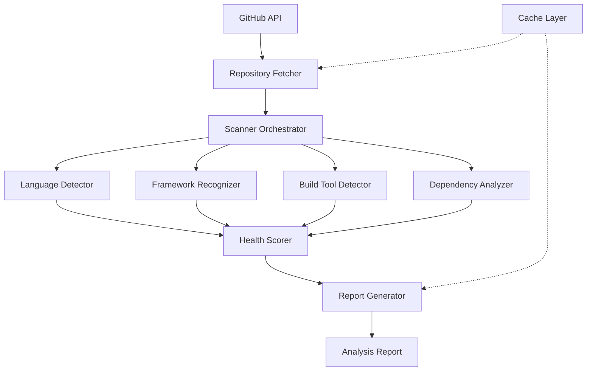

# Universal Scanner Engine - Design Document

## Overview

The Universal Scanner Engine is a modular, extensible system for analyzing repository contents and generating comprehensive health reports. The architecture follows a pipeline pattern where specialized detector components process repository data sequentially, feeding results into a scoring engine that produces actionable insights.

The system integrates with GitHub's API to fetch repository contents, processes files through language-specific analyzers, and generates structured reports with health scores and modernization recommendations.

## Architecture

### High-Level Architecture



### Design Rationale

**Pipeline Architecture**: The scanner uses a pipeline pattern where each detector component operates independently and passes results forward. This design enables:
- Easy addition of new detector types without modifying existing components
- Parallel processing of independent detection tasks
- Graceful degradation when individual detectors fail

**Orchestrator Pattern**: A central orchestrator coordinates detector execution, manages error handling, and aggregates results. This centralizes control flow and makes the system easier to test and maintain.

**Caching Strategy**: Analysis results are cached for 10 minutes based on repository commit SHA. This reduces GitHub API calls and improves response times for repeated scans while ensuring results stay current with repository changes.

## Components and Interfaces

### 1. Scanner Orchestrator

**Responsibility**: Coordinates the analysis pipeline, manages detector execution, handles errors, and aggregates results.

**Interface**:
```typescript
interface ScannerOrchestrator {
  analyzeRepository(owner: string, repo: string): Promise<AnalysisReport>
  getDetectors(): Detector[]
  registerDetector(detector: Detector): void
}

interface Detector {
  name: string
  detect(context: RepositoryContext): Promise<DetectionResult>
  getDependencies(): string[] // Other detectors this depends on
}

interface RepositoryContext {
  owner: string
  repo: string
  files: FileTree
  contents: Map<string, string> // path -> content
  metadata: RepositoryMetadata
}
```

**Key Design Decisions**:
- Detectors are registered dynamically, allowing extensibility
- Each detector receives a shared context object containing all repository data
- Detectors declare dependencies to enable proper execution ordering
- Orchestrator continues execution even if individual detectors fail (Requirement 7)

### 2. Language Detector

**Responsibility**: Identifies programming languages used in the repository with confidence scores.

**Detection Strategy**:
1. Scan file extensions to identify language candidates
2. Parse package manager files (package.json, requirements.txt, etc.) to confirm languages
3. Calculate confidence scores based on:
   - File count (40% weight)
   - Total lines of code (40% weight)
   - Presence of configuration files (20% weight)

**Interface**:
```typescript
interface LanguageDetector extends Detector {
  detect(context: RepositoryContext): Promise<LanguageDetectionResult>
}

interface LanguageDetectionResult {
  languages: DetectedLanguage[]
  primaryLanguage: DetectedLanguage
}

interface DetectedLanguage {
  name: 'JavaScript' | 'TypeScript' | 'Python' | 'Ruby' | 'PHP' | 'Go' | 'Java' | 'C#'
  confidence: number // 0-100
  fileCount: number
  linesOfCode: number
  configFiles: string[]
}
```

**Supported Languages** (Requirement 1):
- JavaScript (.js, package.json)
- TypeScript (.ts, .tsx, tsconfig.json)
- Python (.py, requirements.txt, setup.py)
- Ruby (.rb, Gemfile)
- PHP (.php, composer.json)
- Go (.go, go.mod)
- Java (.java, pom.xml, build.gradle)
- C# (.cs, *.csproj)

### 3. Framework Recognizer

**Responsibility**: Detects frontend and backend frameworks with version information.

**Detection Strategy**:
1. Parse dependency files to identify framework packages
2. Check for framework-specific configuration files
3. Extract version numbers from package manifests
4. Categorize frameworks as frontend or backend

**Interface**:
```typescript
interface FrameworkRecognizer extends Detector {
  detect(context: RepositoryContext): Promise<FrameworkDetectionResult>
}

interface FrameworkDetectionResult {
  frontend: DetectedFramework[]
  backend: DetectedFramework[]
}

interface DetectedFramework {
  name: string
  version: string
  category: 'frontend' | 'backend'
  configFiles: string[]
  confidence: number
}
```

**Supported Frameworks** (Requirement 2):

*Frontend*:
- React (package.json: "react")
- Vue (package.json: "vue", vue.config.js)
- Angular (package.json: "@angular/core", angular.json)
- Svelte (package.json: "svelte", svelte.config.js)
- Next.js (package.json: "next", next.config.js)
- Nuxt (package.json: "nuxt", nuxt.config.js)

*Backend*:
- Express (package.json: "express")
- Django (requirements.txt: "Django", settings.py)
- Rails (Gemfile: "rails", config/application.rb)
- Laravel (composer.json: "laravel/framework")
- FastAPI (requirements.txt: "fastapi")
- NestJS (package.json: "@nestjs/core")

### 4. Build Tool Detector

**Responsibility**: Identifies build tools and bundlers with version information.

**Detection Strategy**:
1. Scan for build tool configuration files
2. Parse package.json scripts for build commands
3. Check dependencies and devDependencies for build tool packages
4. Extract version numbers

**Interface**:
```typescript
interface BuildToolDetector extends Detector {
  detect(context: RepositoryContext): Promise<BuildToolDetectionResult>
}

interface BuildToolDetectionResult {
  buildTools: DetectedBuildTool[]
}

interface DetectedBuildTool {
  name: 'Webpack' | 'Vite' | 'Rollup' | 'esbuild' | 'Parcel' | 'Turbopack'
  version: string
  configFile?: string
  buildScripts: string[]
}
```

**Supported Build Tools** (Requirement 3):
- Webpack (webpack.config.js, webpack.config.ts)
- Vite (vite.config.js, vite.config.ts)
- Rollup (rollup.config.js)
- esbuild (esbuild.config.js)
- Parcel (parcel.config.json, .parcelrc)
- Turbopack (turbo.json)

### 5. Dependency Analyzer

**Responsibility**: Parses project dependencies, identifies outdated packages, and generates dependency lists.

**Detection Strategy**:
1. Parse package manager files based on detected languages
2. Separate direct dependencies from dev dependencies
3. Extract version information for each dependency
4. Compare versions against latest stable releases (external API or cached data)
5. Flag dependencies more than 2 major versions behind

**Interface**:
```typescript
interface DependencyAnalyzer extends Detector {
  detect(context: RepositoryContext): Promise<DependencyAnalysisResult>
}

interface DependencyAnalysisResult {
  dependencies: DependencyInfo[]
  devDependencies: DependencyInfo[]
  outdatedDependencies: OutdatedDependency[]
  totalCount: number
  devCount: number
}

interface DependencyInfo {
  name: string
  installedVersion: string
  latestVersion?: string
  type: 'direct' | 'dev'
  ecosystem: 'npm' | 'pip' | 'gem' | 'composer'
}

interface OutdatedDependency extends DependencyInfo {
  majorVersionsBehind: number
  severity: 'critical' | 'warning' | 'info'
}
```

**Supported Package Managers** (Requirement 4):
- npm/yarn/pnpm (package.json)
- pip (requirements.txt)
- bundler (Gemfile)
- composer (composer.json)

### 6. Health Scorer

**Responsibility**: Calculates comprehensive health scores based on multiple quality factors.

**Scoring Algorithm** (Requirement 5):

The health scorer implements a weighted scoring system with a maximum of 100 points distributed across six categories:

| Category | Max Points | Criteria |
|----------|-----------|----------|
| Dependency Health | 25 | Version recency, outdated packages |
| Framework Modernity | 25 | Framework versions, deprecated patterns |
| Build Health | 20 | Config completeness, build scripts |
| Code Quality | 15 | TypeScript adoption, test coverage |
| Documentation | 10 | README presence, completeness |
| Repository Activity | 5 | Days since last commit |

**Scoring Logic**:

```typescript
interface HealthScorer {
  calculateScore(analysisData: AnalysisData): HealthScore
}

interface HealthScore {
  total: number // 0-100
  categories: {
    dependencyHealth: CategoryScore
    frameworkModernity: CategoryScore
    buildHealth: CategoryScore
    codeQuality: CategoryScore
    documentation: CategoryScore
    repositoryActivity: CategoryScore
  }
}

interface CategoryScore {
  score: number
  maxScore: number
  factors: ScoringFactor[]
}

interface ScoringFactor {
  name: string
  impact: number // positive or negative
  description: string
}
```

**Detailed Scoring Rules**:

*Dependency Health (25 points)*:
- Start with 25 points
- Deduct 5 points per dependency >2 major versions outdated (max -15)
- Deduct 3 points per dependency 1-2 major versions outdated (max -10)
- Bonus +2 points if all dependencies are current

*Framework Modernity (25 points)*:
- Start with 25 points
- Deduct 10 points per framework >1 major version behind
- Deduct 5 points per framework on current major but outdated minor
- Bonus +3 points for using latest stable versions

*Build Health (20 points)*:
- 10 points for presence of build configuration file
- 5 points for build scripts in package.json
- 5 points for modern build tool (Vite, esbuild, Turbopack)

*Code Quality (15 points)*:
- 8 points for TypeScript adoption (proportional to TS vs JS ratio)
- 7 points for test file presence (proportional to test coverage)

*Documentation (10 points)*:
- 4 points for README.md presence
- 3 points for README length >500 characters
- 3 points for README sections (Installation, Usage, etc.)

*Repository Activity (5 points)*:
- 5 points if last commit within 30 days
- Linear reduction to 0 points at 365 days
- Formula: `max(0, 5 * (1 - (daysSinceCommit - 30) / 335))`

### 7. Report Generator

**Responsibility**: Aggregates all detection results and generates structured analysis reports.

**Interface**:
```typescript
interface ReportGenerator {
  generate(analysisData: AnalysisData): AnalysisReport
}

interface AnalysisReport {
  repository: {
    owner: string
    name: string
    analyzedAt: Date
    commitSha: string
  }
  languages: LanguageDetectionResult
  frameworks: FrameworkDetectionResult
  buildTools: BuildToolDetectionResult
  dependencies: DependencyAnalysisResult
  healthScore: HealthScore
  issues: Issue[]
  recommendations: Recommendation[]
  metadata: {
    analysisVersion: string
    completionStatus: 'complete' | 'partial'
    errors: string[]
  }
}

interface Issue {
  severity: 'critical' | 'warning' | 'info'
  category: string
  title: string
  description: string
  affectedFiles?: string[]
}

interface Recommendation {
  priority: 'high' | 'medium' | 'low'
  category: string
  title: string
  description: string
  actionItems: string[]
  estimatedEffort: 'low' | 'medium' | 'high'
}
```

**Report Generation Logic** (Requirement 6):
1. Aggregate all detector results
2. Calculate health scores
3. Generate issues based on detection findings
4. Create prioritized recommendations
5. Add metadata about analysis completeness
6. Serialize to JSON format

## Data Models

### File Tree Structure

```typescript
interface FileTree {
  files: FileNode[]
  totalFiles: number
  totalSize: number
}

interface FileNode {
  path: string
  type: 'file' | 'dir'
  size: number
  sha: string
  content?: string // Lazy-loaded for files
}
```

### Repository Metadata

```typescript
interface RepositoryMetadata {
  owner: string
  name: string
  fullName: string
  defaultBranch: string
  language: string | null
  createdAt: Date
  updatedAt: Date
  pushedAt: Date
  size: number
  stargazersCount: number
  forksCount: number
}
```

## Error Handling

### Error Handling Strategy (Requirement 7)

The scanner implements graceful degradation to ensure partial results are always available:

**Error Categories**:
1. **Missing Files**: Continue analysis with available files
2. **Parse Errors**: Log error, mark detector as incomplete, continue
3. **GitHub API Errors**: Return cached results if available, otherwise fail fast
4. **Timeout Errors**: Return partial results with timeout flag

**Implementation**:
```typescript
interface DetectorResult<T> {
  success: boolean
  data?: T
  error?: {
    code: string
    message: string
    recoverable: boolean
  }
}

class ScannerOrchestrator {
  async analyzeRepository(owner: string, repo: string): Promise<AnalysisReport> {
    const errors: string[] = []
    const results: Map<string, DetectorResult<any>> = new Map()
    
    for (const detector of this.detectors) {
      try {
        const result = await this.executeWithTimeout(
          detector.detect(context),
          30000 // 30 second timeout per detector
        )
        results.set(detector.name, { success: true, data: result })
      } catch (error) {
        errors.push(`${detector.name}: ${error.message}`)
        results.set(detector.name, {
          success: false,
          error: {
            code: error.code,
            message: error.message,
            recoverable: true
          }
        })
        // Continue with next detector
      }
    }
    
    return this.reportGenerator.generate({
      results,
      metadata: {
        completionStatus: errors.length > 0 ? 'partial' : 'complete',
        errors
      }
    })
  }
}
```

**Error Response Format**:
```typescript
interface ErrorResponse {
  error: string
  code: string
  details?: any
  partialResults?: Partial<AnalysisReport>
}
```

## Caching and Performance

### Caching Strategy (Requirement 8)

**Cache Implementation**:
- Use Redis for distributed caching
- Cache key format: `scanner:${owner}:${repo}:${commitSha}`
- TTL: 10 minutes (600 seconds)
- Invalidation: Automatic on commit SHA change

**Cache Layer**:
```typescript
interface CacheService {
  get(key: string): Promise<AnalysisReport | null>
  set(key: string, value: AnalysisReport, ttl: number): Promise<void>
  invalidate(pattern: string): Promise<void>
}

class CachedScannerOrchestrator extends ScannerOrchestrator {
  constructor(
    private cache: CacheService,
    detectors: Detector[]
  ) {
    super(detectors)
  }
  
  async analyzeRepository(owner: string, repo: string): Promise<AnalysisReport> {
    // Get latest commit SHA
    const commitSha = await this.getLatestCommitSha(owner, repo)
    const cacheKey = `scanner:${owner}:${repo}:${commitSha}`
    
    // Check cache
    const cached = await this.cache.get(cacheKey)
    if (cached) {
      return cached
    }
    
    // Perform analysis
    const report = await super.analyzeRepository(owner, repo)
    
    // Cache results
    await this.cache.set(cacheKey, report, 600)
    
    return report
  }
}
```

### Performance Optimizations

**Parallel Processing**:
- Fetch multiple configuration files concurrently
- Run independent detectors in parallel
- Use Promise.allSettled to handle failures gracefully

**Memory Management**:
- Stream large files instead of loading entirely into memory
- Limit file content caching to files <1MB
- Process files in batches of 50
- Target memory usage: <512MB per analysis

**Timeout Management**:
- Overall analysis timeout: 30 seconds
- Individual detector timeout: 10 seconds
- GitHub API request timeout: 5 seconds

**Implementation**:
```typescript
class PerformanceOptimizedOrchestrator extends ScannerOrchestrator {
  async analyzeRepository(owner: string, repo: string): Promise<AnalysisReport> {
    const startTime = Date.now()
    const timeout = 30000 // 30 seconds
    
    // Fetch repository data with timeout
    const context = await this.fetchRepositoryContext(owner, repo, timeout)
    
    // Group detectors by dependencies
    const detectorGroups = this.groupDetectorsByDependencies()
    
    // Execute detector groups in parallel
    const results = new Map()
    for (const group of detectorGroups) {
      const groupResults = await Promise.allSettled(
        group.map(detector => 
          this.executeWithTimeout(
            detector.detect(context),
            Math.min(10000, timeout - (Date.now() - startTime))
          )
        )
      )
      
      // Aggregate results
      group.forEach((detector, index) => {
        const result = groupResults[index]
        results.set(detector.name, result)
      })
      
      // Check overall timeout
      if (Date.now() - startTime > timeout) {
        break
      }
    }
    
    return this.reportGenerator.generate({ results, context })
  }
  
  private groupDetectorsByDependencies(): Detector[][] {
    // Topological sort of detectors based on dependencies
    // Returns groups where detectors in same group can run in parallel
    // Implementation details omitted for brevity
    return []
  }
}
```

## Testing Strategy

### Unit Testing

**Detector Tests**:
- Test each detector with mock repository contexts
- Verify confidence score calculations
- Test error handling for malformed files
- Validate output format compliance

**Scorer Tests**:
- Test scoring algorithm with various input combinations
- Verify point allocation matches specification
- Test edge cases (empty repo, all outdated dependencies, etc.)

**Example Test**:
```typescript
describe('LanguageDetector', () => {
  it('should detect TypeScript with high confidence', async () => {
    const context = createMockContext({
      files: [
        { path: 'src/index.ts', type: 'file' },
        { path: 'tsconfig.json', type: 'file' }
      ],
      contents: new Map([
        ['tsconfig.json', '{"compilerOptions": {}}']
      ])
    })
    
    const detector = new LanguageDetector()
    const result = await detector.detect(context)
    
    expect(result.languages).toContainEqual(
      expect.objectContaining({
        name: 'TypeScript',
        confidence: expect.any(Number)
      })
    )
    expect(result.languages[0].confidence).toBeGreaterThan(80)
  })
})
```

### Integration Testing

**End-to-End Tests**:
- Test full analysis pipeline with real repository data
- Verify caching behavior
- Test timeout handling
- Validate report generation

**GitHub API Integration Tests**:
- Mock Octokit responses
- Test rate limit handling
- Verify error recovery

### Performance Testing

**Benchmarks**:
- Measure analysis time for repositories of various sizes
- Verify memory usage stays under 512MB
- Test concurrent analysis requests
- Validate cache hit rates

## API Integration

### GitHub API Usage

The scanner integrates with GitHub's REST API following the project's established patterns:

**Repository Content Fetching**:
```typescript
import { createOctokit } from '@/lib/github/client'
import { GitHubRepositoryService } from '@/lib/github/services/repository'

class RepositoryFetcher {
  constructor(private octokit: Octokit) {}
  
  async fetchRepositoryContext(
    owner: string,
    repo: string
  ): Promise<RepositoryContext> {
    const repoService = new GitHubRepositoryService(this.octokit)
    
    // Fetch repository metadata
    const metadata = await repoService.getRepository(owner, repo)
    
    // Fetch file tree
    const tree = await this.fetchFileTree(owner, repo, metadata.defaultBranch)
    
    // Fetch relevant configuration files
    const configFiles = this.identifyConfigFiles(tree)
    const contents = await this.fetchFileContents(owner, repo, configFiles)
    
    return {
      owner,
      repo,
      files: tree,
      contents,
      metadata
    }
  }
  
  private async fetchFileTree(
    owner: string,
    repo: string,
    branch: string
  ): Promise<FileTree> {
    // Use GitHub Trees API for efficient file listing
    const { data } = await this.octokit.git.getTree({
      owner,
      repo,
      tree_sha: branch,
      recursive: 'true'
    })
    
    return {
      files: data.tree.map(node => ({
        path: node.path!,
        type: node.type as 'file' | 'dir',
        size: node.size || 0,
        sha: node.sha!
      })),
      totalFiles: data.tree.length,
      totalSize: data.tree.reduce((sum, node) => sum + (node.size || 0), 0)
    }
  }
}
```

**Rate Limit Handling**:
- Check rate limits before expensive operations
- Use caching to minimize API calls
- Implement exponential backoff for rate limit errors
- Follow project's GitHub API integration guidelines

## Deployment Considerations

### Environment Variables

```env
# GitHub API
GITHUB_ACCESS_TOKEN=<token>

# Redis Cache
UPSTASH_REDIS_REST_URL=<url>
UPSTASH_REDIS_REST_TOKEN=<token>

# Scanner Configuration
SCANNER_TIMEOUT_MS=30000
SCANNER_MAX_FILE_SIZE_MB=1
SCANNER_CACHE_TTL_SECONDS=600
```

### API Endpoints

```typescript
// app/api/scan/[owner]/[repo]/route.ts
export async function GET(
  request: Request,
  { params }: { params: { owner: string; repo: string } }
) {
  const session = await auth()
  if (!session?.accessToken) {
    return Response.json({ error: 'Unauthorized' }, { status: 401 })
  }
  
  try {
    const octokit = createOctokit(session.accessToken)
    const scanner = new CachedScannerOrchestrator(
      cacheService,
      [
        new LanguageDetector(),
        new FrameworkRecognizer(),
        new BuildToolDetector(),
        new DependencyAnalyzer(),
      ]
    )
    
    const report = await scanner.analyzeRepository(params.owner, params.repo)
    
    return Response.json(report)
  } catch (error) {
    if (error instanceof GitHubAPIError) {
      return Response.json(
        { error: error.message, rateLimit: error.rateLimit },
        { status: error.statusCode || 500 }
      )
    }
    
    return Response.json(
      { error: 'Analysis failed', details: error.message },
      { status: 500 }
    )
  }
}
```

## Future Enhancements

Potential improvements for future iterations:

1. **Additional Language Support**: Add support for Rust, Kotlin, Swift, Dart
2. **Security Scanning**: Integrate vulnerability detection for dependencies
3. **License Compliance**: Detect and validate open source licenses
4. **Code Metrics**: Add cyclomatic complexity and code duplication detection
5. **CI/CD Detection**: Identify GitHub Actions, CircleCI, Jenkins configurations
6. **Docker Support**: Detect and analyze Dockerfile and docker-compose.yml
7. **Database Detection**: Identify database usage and migrations
8. **API Documentation**: Detect OpenAPI/Swagger specifications
9. **Incremental Analysis**: Only re-analyze changed files
10. **Custom Rules**: Allow users to define custom detection rules
   